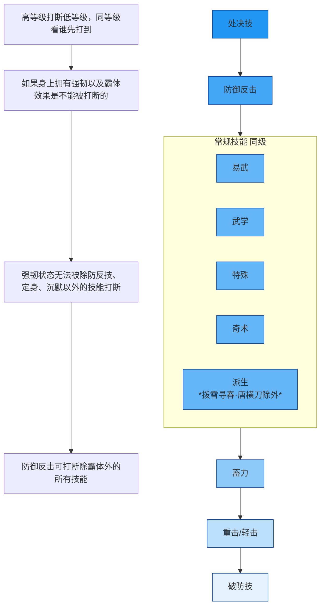
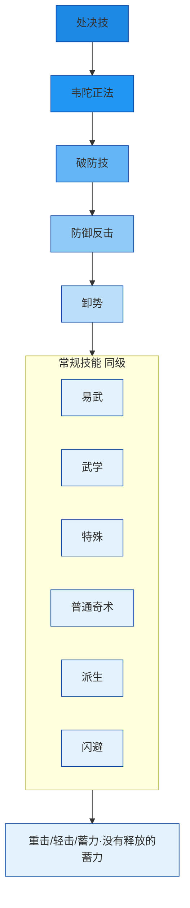

# 更新日志

| 日期       | 改动                                                         | 备注 |
| ---------- | ------------------------------------------------------------ | ---- |
| 2026-xx-xx | - 1.2，心法大唐歌 换 怒斩马 - 1.5，增加尘镖蓄力技能详情 - 1.6，奇术使用技巧改为2.7 - 2.1，增加论剑段位介绍 - 2.5，增加全流派应对技巧(完善中） - 2.6，增加奇术伤害倍率/损耗 |      |
| 2026-01-28 | - 1.6和2.4奇术部分，修正并补充应对方法 - 1.4修正真连为伪连 |      |
| 2026-01-27 | - 1.6，完善五个奇术的技巧 - 2.4，增加全流派(除鸢鸢)技能特性 - 2.4，增加常用奇术技能特性 |      |
| 2026-01-13 | - 0PVE内容拓展 - 1.6，拓展新奇术技巧 - 2.4，新增技能特性汇总表 |      |
| 2026-01-12 | - 初次整理                                                   |      |

# 0 PVE

[打桩输出手法](https://www.xiaohongshu.com/explore/69678fd4000000000d00ae4b?xsec_token=ABzeHtSOVNsolFIs8NwKS3082fwZZBxbClfodyf5NhQY0=&xsec_source=pc_search&source=unknown)

## 套装选择和调率

套装：PVE防具套无要求，**武器4件套选连星套**，提供最高20%的武学技增伤(需要距离boss至少8米)。

12条大外 +10条劲+2全武学+一伞增+2首领增伤+2精准+8会心+2敏

> 会心78+(白字145%)
> 精准100(白字130%)
>
> 大外>劲>小外
> 1劲=0.225小外+1.36大外
> 首词条可以刷出重复词条
>
> 敏两条最好，只少不能多
> 外功[1657, 4046]，理论极限
> 外功穿透X4（50，理论极限51.2）、醉梦游春增伤（27%，理论极限28）
> 绳舟没有六重前，不打响指

| 装备 | 首词条            | 调律词条   | 定音               |
| ---- | ----------------- | ---------- | ------------------ |
| 伞   | 最大外功攻击      | 伞增+大外  | 外攻穿透           |
| 镖   | 最大外功攻击      | 大外       | 外攻穿透           |
| 环佩 | 最大外功攻击      | 2全武+大外 | 外攻穿透           |
| 冠胄 | 会心              | 大外       | 醉梦游春武学技增伤 |
| 胸甲 | 会心              | 大外       | 醉梦游春武学技增伤 |
| 胫甲 | 劲/会心(更推荐劲) | 首增+大外  | 醉梦游春武学技增伤 |
| 腕甲 | 劲/会心(更推荐劲) | 首增+大外  | 醉梦游春武学技增伤 |

# 1 破竹尘流派 PVP 笔记

## 1.1 装备要点

套装：**时雨+江凝套**，**连星套需要叠层**，PVP难以叠加

1. **佩·定音尘镖蓄力技**：<蓄力技：镖鸣彻野>，尘镖蓄力技命中1.5秒强韧（弱于霸体）。
2. **环·定音武学技扔伞**：带强韧，注意把控CD，用于走位博弈。  
3. **环·定音尘伞吸附可附加真气伤害**，可尝试 **吸附+处决**。
4. **尘镖 buff 效果**：挂上后，对方真气条变黄时伤害提高，且真气清除速度加快。

| 装备 | 定音                                                         | 备注                         |
| ---- | ------------------------------------------------------------ | ---------------------------- |
| 武器 | 1.使用处决技后可使自身恢复30点精元，并恢复伤害量20%的气血值 2.使用防御反击技命中未处于防御状态的单位时，额外造成15点真气伤害，并恢复自身5点真气 | 主副武器同样的定音效果不叠加 |
| 环佩 | 环·定音扔伞 佩·定音尘镖蓄力技<蓄力技：镖鸣彻野>          | 根据武学流派变化             |
| 冠胄 | 解除受击或者受控制状态时，获得2.8秒的强韧效果                |                              |
| 胸甲 | 自身处于受击状态时，受到的伤害降低28%                        |                              |
| 胫甲 | 1.闪避成功抵消敌方攻击后，使自身恢复20点真气，触发间隔10秒 2.闪避成功抵消敌方攻击后，使自身恢复8%最大气血，触发间隔10秒 |                              |
| 腕甲 | 1.卸势成功时，使自身恢复16点真气，触发间隔10秒               |                              |

---

## 1.2 心法 + 奇术
- 千营一呼
- 易水歌 换 婆娑影
- 绳舟行木
- 大唐歌 换 怒斩马(增加博弈)

必带：清风霁月、药叉破魔、骑龙回马

推荐：神龙吐火+太白醉月+阴阳迷踪步+金蟾腾跃+金玉手

可选：凌云踏+韦陀正法

---

## 1.3 开局起手
开局索敌+喝酒+尘镖武学（挂摄魂，强化尘镖蓄力技）→ 卸势打断

> 如果对手是玉玉，在放抛春恨就不要喝酒

---

## 1.4 连招

### 连招一
喝酒 → 尘镖蓄力技 → 骑龙回马(可被卸势) → 尘镖武学技 → 尘镖蓄力技 → 响指 → 尘伞武学技 → 尘伞特殊技 → 处决 → 吐火(火烧到对面身上立马点卸势打断)

### 连招二
喝酒 → 尘镖蓄力技 → 尘伞武学技 → 尘镖武学技 → 响指 → 尘伞武学技（一下） → 尘伞特殊技换位 → 处决 → 吐火(火烧到对面身上立马点卸势打断)

> 吐火后提前卸势 或 位移拉远，避免被反抓僵直。

---

## 1.5 技能衔接与技巧

### 尘镖相关
- 尘镖蓄力技不打最后一段，可接 **自在无碍**。
- 尘镖蓄力技 + 尘镖武学技
- 尘镖蓄力技第一段（横扫拉近敌人）+ 蛤蟆（变体）
- 尘镖蓄力技过程中 + 吐火（利用霸体强顶对方霸体，防被连）
- 尘镖处决后可接一套蛤蟆
- 骑龙回马 + 尘镖武学技
- 尘镖挂满 buff 的响指有击飞效果，可顺势接尘伞打伤害
- 根据蓄力时长会获取不同的效果:持续1.5秒:下一次蓄力技镖鸣彻野获得强化，每段伤害容易对敌人造成更大的受击硬直。持续3秒:自身缓慢回复生命，特续至蓄力姿态结束。持续4.5秒:自身缓慢回复真气，持续至蓄力姿态结束。

### 尘伞相关
- 尘伞共鸣（20秒仅触发一次，聚拢效果）可断金光骑龙回马
- 尘伞扔伞后，快速切换尘镖蓄力（霸体），防被抓僵直
- 尘伞不接伞 + 药叉破魔（沉默对方）
- 尘伞换位 + 药叉破魔（沉默对方）
- 尘伞被卸势时，自己也卸势，可打断对方卸势节奏
- 尘伞两段换位 或 尘伞特殊技 + 卸势，用于拉扯
- 尘伞特殊技最后一段需卸势下伞，否则易被抓僵直

# 2 PVP 拓展知识

## 2.1 名词解释

### 状态类

1. **受击**：被对手攻击且无法反击时的状态。
2. **强韧**：自身拥有强韧效果时，对手的技能无法让你进入受击状态（除控制技能外）。
3. **霸体**：自身拥有霸体效果时，对手的任何技能都无法让你进入受击状态。
4. **控制**：被定身，无法使用除解控外的任意动作和技能时的状态。
5. **沉默**：无法使用除解控外任意技能时的状态（可以移动）。
6. **破防**：在防御和卸势状态下被破防奇术命中，或是在耐力不足情况下防御被攻击。
7. **气竭**：血条下方的蓝色真气槽被清空后的状态。

### 动作类

1. **真连**：通过连招不断攻击对手，此时对手无法使用除解控外的任何技能。
2. **伪连**：通过连招不断攻击对手时，对手通过卸势或者闪避中断了你的连招。
3. **喝酒**：使用奇术“太白醉月”后会喝一口酒，可提前用卸势打断。
4. **快火**：喝酒后使用“神龙吐火”，可跳过喝酒动作直接吐火。
5. **慢火**：未提前喝酒时使用“神龙吐火”，会先展示喝酒动作然后再吐火。
6. **解控**：可以解除受击、控制、沉默状态。
7. **卸势**：卸势成功时将抵消伤害并削减对手真气，卸势会消耗自身耐力。
8. **防御**：防御会大幅降低受到的伤害，但会消耗自身耐力。
9. **格反**：防御对手攻击后，可以使用防守反击打断对手的动作。
10. **黄光骑龙**：被对手攻击到的瞬间使用“骑龙回马（5重）”。
11. **反骑龙**：被对手“骑龙回马”打中前的瞬间，使用“骑龙回马（5重）”。
12. **后长闪**：不按任何方向键的时候按下闪避键，角色将作出后跳动作。
13. **处决**：当对手处于气竭状态时，使用处决按钮。
14. **慢处决**：当对手触发“守关元”时，等待1-2秒再处决，可跳过其无敌状态。
15. **处决吐火**：处决后马上使用“神龙吐火”。
16. **快跑**：闪避后一直按方向键进入快跑状态，期间会不断消耗耐力。
17. **跑狗**：以远程消耗为主，一直与你拉开距离或拖延时间的战斗方式。
18. **跑a**：快跑时使用普通攻击。
19. **闪a**：闪避后使用普通攻击。
20. **q1q2**：Q为PC端武学技的按键，q1q2即为快速按两下武学技。
21. **r1r2**：R为PC端重击/蓄力的按键，r1r2即为快速按两下重击。
22. **a1a2**：a为普通攻击键，a1a2即为普通攻击两下。

### 简称

1. **蛤蟆**：代表奇术金蟾腾岳
2. **点剑**：无名剑法的武学技，远程第一段
3. **燕反**：无名剑法的特殊技，特殊技第一段
4. **大砸**：无名剑特殊技第二段
5. **钻头**：双刀泥犁三垢的武学技
6. **老鼠**：绳镖栗子游尘召唤出的鼠鼠。

### 段位

出鞘、仗剑、游刃、开山、断水、

斩风、流云、藏锋、飞花、无我。

一共10个段位，每个段位3个阶段

## 2.2 打断对方技能优先级

待验证：

> 定身技如乾坤定和唐刀特殊以及玉玉挑飞的优先级仅低于处决，韦陀也没法打断
>
> 易武技也只能被处决打断

## 2.3 打断自身技能优先级

## 2.4 技能特性汇总表

### 武学流派

- 玉玉/无名没有强韧或者霸体
- 鸢鸢未整理

| 流派        | 武器 | 技能类型                  | 触发条件/效果 | 状态         |
| ----------- | ---- | ------------------------- | ------------- | ------------ |
| **钧钧**    | 唐刀 | 特殊技                    | 基础效果      | 强韧         |
|             |      | 轻击蓄力                  | 非止戈状态    | 强韧         |
|             |      | 重击派生                  | 卸反效果      | 强韧         |
|             |      | 轻击派生                  | 基础效果      | 强韧         |
|             | 钧陌 | 特殊技                    | 基础效果      | 强韧         |
|             |      | 武学技释放3秒后           | 时间触发      | 强韧         |
|             |      | 特殊定音下荡八荒释放后3秒 | 定音+时间     | 强韧         |
| **尘尘**    | 尘伞 | 特殊技                    | 基础效果      | 强韧         |
|             |      | 武学技                    | 非止戈状态    | 强韧         |
|             |      | 武学技，特殊定音下        | 额外效果      | 强韧         |
|             | 尘绳 | 特殊技响指                | 基础效果      | 强韧         |
|             |      | 武学技                    | 非止戈状态    | 强韧         |
|             |      | 蓄力姿态                  | 基础效果      | 强韧         |
|             |      | 特殊定音下蓄力命中        | 定音+命中     | 强韧         |
| **威威**    | 威陌 | 特殊技                    | 基础效果      | 强韧         |
|             |      | 特殊定音下                | 延长强韧      | 强韧         |
|             |      | 特殊定音下命中2人及以上   | 人数条件      | **霸体**     |
|             |      | 蓄力                      | 基础效果      | 强韧         |
|             |      | 防反派生                  | 基础效果      | 强韧         |
|             |      | 特殊定音下武学技          | 定音触发      | **2秒霸体**  |
|             | 八枪 | 蓄力技                    | 基础效果      | 强韧         |
|             |      | 武学技                    | 基础效果      | 强韧         |
|             |      | 特殊技                    | 基础效果      | 强韧         |
|             |      | 特殊定音下                | 定音触发      | **2秒霸体**  |
| **风风/99** | 风绳 | 蓄力技                    | 基础效果      | 强韧         |
|             | 双刀 | 开红                      | 基础效果      | 强韧         |
|             |      | 特殊定音下特殊技          | 定音触发      | 强韧         |
|             | 九枪 | 蓄力技                    | 基础效果      | 强韧         |
|             |      | 武学技                    | 基础效果      | 强韧         |
|             |      | 逐狼心经装备              | 效果增强      | 强韧         |
|             |      | 特殊定音下特殊技命中      | 定音+命中     | 强韧         |
| **霖霖**    | 霖伞 | 特殊定音下武学技命中队友  | 增益自己      | **自己霸体** |
|             |      | 特殊定音下蓄力技          | 增益自己      | 自己强韧     |
|             | 霖扇 | 特殊定音下重击命中队友    | 增益队友      | 队友强韧     |
|             |      | 特殊定音下特殊技命中队友  | 增益队友      | 队友强韧     |

## 2.5 全流派应对技巧(未完成)

[视频](https://www.xiaohongshu.com/explore/68bda237000000001d01a9a4?xsec_token=ABlyK15LDIZQzZ1TBqP4aQ5ZBPEkTwgDvZEX55VF-rIdY=&xsec_source=pc_search&source=unknown)

| 流派      |                |      |
| --------- | -------------- | ---- |
| 虹虹      |                |      |
| 虹影/双剑 |                |      |
| 影影      |                |      |
| 风风      |                |      |
| 威威      |                |      |
| 玉玉      | 跑春恨(前闪)   |      |
| 霖霖      |                |      |
| 尘尘      |                |      |
| 霖玉      |                |      |
| 钧钧      |                |      |
| 鸢鸢      | 无强韧，有完挡 |      |
| 尘鸢/双镖 |                |      |
|           |                |      |

## 2.6 奇术特性

### 奇术特性

| 奇术名称     | 特性        | 核心机制                | 关键技巧与连招                                                                                                                                                |
| -------- | --------- | ------------------- | ------------------------------------------------------------------------------------------------------------------------------------------------------ |
| **神龙吐火** | 强韧        | 快火卸势需2次         | 1. **提前喝酒**可吐快火。  2. 卸掉一次，可接闪避。 3. 慢火可**骗【药叉】**                                                                                                |
| **太白醉月** | 强韧 减伤 | 五连拳击，第五拳击飞。         | 1. **前四拳**命中可接处决。  2. 灵活运用其强韧**顶掉对手技能**。                                                                                                           |
| **无相金身** | 强韧        | **回复生命与真气**，并添加护盾。  | 1. 护盾可**防【青山执笔】挑飞**。  2. 可在气竭时开启尝试反打。                                                                                                              |
| **骑龙回马** | 完闪        | **后撤步触发**完美闪避反击     | 1. 不可卸势，可闪避。                                                                                                                                           |
| **金蟾腾跃** | 强韧        | 共三段，附带爆毒。           | 1. 击倒后接金蟾，连招稳固。  2. 爆毒后有僵直，**通常可接处决**或者连招。  3. 可骗**【药叉】**。                                                                                     |
| **凌云踏**  | 破强韧       | **破除强韧**，强力卸势技。     | 1. **好目卸势**后可接【神龙吐火】。 2. 可将空中释放 **【九重春色】** 的对手**踹下来**。 3. 主要的破霸体、抓机会起手技能。                                                                      |
| **清风霁月** | 霸体        | 关键**解控技能**，CD长（30秒） | 1. 有 **【定音】** 效果可**减少4秒CD**。 2. **有时硬扛比交解控更划算**。 3. **何时交**：     1. 对手挂快火时     2. 双剑易武/自在无碍时（打满伤害） 4. **何时不交**：自己马上**气竭**时，直接让对手处决 |

### 奇术伤害倍率/损耗

[奇术视频](https://www.xiaohongshu.com/explore/6967a03a000000000e00f217?xsec_token=ABzeHtSOVNsolFIs8NwKS306YZ3APXuT-Qu4NaHhffy48=&xsec_source=pc_search&source=unknown)

>6重 · 25 表格

| 奇术名称     | 特性               | 精元/调息  | 伤害                                                                                                                          | 备注                                                                                                              |
| -------- | ---------------- | ------ | --------------------------------------------------------------------------------------------------------------------------- | --------------------------------------------------------------------------------------------------------------- |
| **金玉手**  | 破气               |        | 103.28%外功攻击+163外功伤害+属性伤害                                                                                                    |                                                                                                                 |
| **神龙吐火** | 强韧               | 20/6   | 两段共计：272.18%外功攻击+430外功伤害+属性伤害 两段额外：149.98%外功攻击+237外功伤害+属性伤害 爆燃(每0.5s，共8s)：29.55%外功攻击+46外功伤害+属性伤害                    | 喝酒20精元，醉酒(持续30s) 技能过程：15%伤害减免及强韧 爆燃可叠层，每层会提升1.5秒存续时长 最高叠10层 两段喷火均中，额外获一层 爆燃状态中受到太白醉月攻击，额外获一层 |
| **太白醉月** | 强韧 减伤        | 10/0.1 | 前四段：102.34%外功攻击+160外功伤害+属性伤害 最后一段：170.56%外功攻击+268外功伤害+属性伤害 爆炸：70.17%外功攻击+1107外功伤害+属性伤害                          | 喝酒10精元，醉酒(持续30s) 每拳6精元(共五拳，施加酒气)                                                                            |
| **无相金身** | 强韧               | 50/20  | 8s：护盾值和真气回复，获得强韧效果(4s)和减伤效果                                                                                                 |                                                                                                                 |
| **骑龙回马** | 完闪               | 15/12  | 一段：319.65%外功攻击+504外功伤害+属性伤害 二段：390.69%外功攻击+616外功伤害+属性伤害                                                                 |                                                                                                                 |
| **金蟾·影** | 强韧               | 25/8   | 翻身：51.01%外功攻击+80外攻伤害+属性伤害 冲击：306.04%外功攻击+484外玫伤害+属性伤害 金蟾压顶：459.07%外功攻击+727外攻伤害+属性伤害 蟾毒：153.02%外功攻击+242外攻伤害+属性伤害 | 毒爆完美闪避恢复1000+血                                                                                                  |
| **凌云踏**  | 破强韧              |        | 普：105.40%外功攻击+165外功伤害+属性伤害 破：210.79%外功攻击+331外功伤害+属性伤害                                                                   |                                                                                                                 |
| **清风霁月** | 解控 霸体        |        | 109.07%外功攻击+538外功伤害+163.60%s属攻系数+属性伤害 降低调息时间。                                                                       | 降低目标50%耐力回复速度 持续8秒 解控成功并命中玩家造成额外真气伤害 并在自身未处于气竭时额外恢复真气                                               |
| **迷踪·影** |                  | 40/60  | 204.16%外功攻击+312外功伤害+属性伤害                                                                                                    | 持续20秒 地面闪避类技能降低40%耐力消耗 小幅度提升不可选中时长 完美闪避造成伤害 触发完美闪避后提升自身伤害                                       |
| **药叉破魔** | 破防               | 15/2   | 一段：73.88%外功攻击+115外功伤害+属性伤害 二段：295.53%外功攻击+462外功伤害+属性伤害 破防额外：184.71%外功攻击+289外功伤害+属性伤害                                |                                                                                                                 |
| **鹰抓连凿** | 破防               | 15/2   | 四段：288.83%外功攻击+247外功伤害+属性伤害 破防：288.83%外功攻击+247外功伤害+属性伤害                                                                 |                                                                                                                 |
| **自在无碍** |                  | 30/3   | 第一击：143.43%外功攻击+225外功伤害+属性伤害 中间：430.28%外功攻击+677外功伤害+属性伤害 下砸：143.43%外功攻击+225外功伤害+属性伤害                                |                                                                                                                 |
| **韦陀正法** |                  |        |                                                                                                                             |                                                                                                                 |
| **狮吼功**  | 群战 沉默 减伤 |        |                                                                                                                             | 造成14段伤害 技能过程获15%伤害减免及强韧 技能连续命中造成额外的沉默效果 提升技能释放中的伤害减免效果 吼叫对目标造成耐力伤害                              |
| **流星坠火** | 群战 霸体        |        |                                                                                                                             |                                                                                                                 |

### 奇术精元恢复

## 2.7 奇术使用技巧

### 1. 神龙吐火技巧(强韧)

- **开局喝酒卸势**：可以吐快火（缩短前摇）。

#### **使用技巧**：

- 处决后吐快火，配合火拳有高伤害（即太白醉月）。
- 在对手率先出手且无法快速切断时，可以吐火打断。

#### 反制方法

  - 动作：喝酒→弯腰→一段火→从左到右喷(卸势)→最右端掉头(卸势)→第二段火
  - 卸势需斜干净两段，在弯腰时即可按卸势。
  - 注意：有概率是吐火转药叉，可能被骗。

### 2. 太白醉月技巧(强韧)

- **应对**：可以卸掉，但更推荐卸一两段后跑(避免被药叉破魔)。
- **使用**：参考神龙吐火的使用技巧。

### 3. 火拳(神龙吐火+太白醉月)

#### 连招技巧

- 处决 + 吐火（火烧到后立即用“卸势”打断）+ 醉拳（五下）。
- 若吐火未命中，立即用“卸势”拉开距离。吐火带有僵直效果，可利用。

#### 反制方法

- 被处决后，对方接吐火时，起身迅速拉开距离，躲开前几拳。
- 远距离使用“伞”进行消耗。

---

### 4. 点穴技巧

#### 点穴消耗

- 点穴 + 尘伞武学技。

#### 点穴躲技能

- 可用于躲避：凌云踏、无名的点剑、玉玉抛春恨。

#### 点穴接处决

- 对方处于处决状态时，若不想用凌云踏近身（避免被反打），可使用“点穴接处决”。
- 注意点穴距离，不宜过远。

#### 反制方法

- 可以反向点穴
- 可闪可防，不可卸势。对方下蹲时闪避可以回血

---

### 5. 金蟾腾岳技巧(强韧)

蟾毒效果：五秒后自爆

#### 普通金蟾腾跃 动作

**一段**(15点精元，蟾毒效果)：趴下 → 前顶 → 跳出。

- **卸势点**：趴下即将顶出的瞬间。

**二段**(15点精元，蟾毒效果)：动作与一段相同。

- **卸势点**：同上。

**三段**(15点精元，蟾毒效果)：高跃 → 追踪下砸。

- **卸势点**：下砸瞬间。
- **注意**：该段攻击带追踪、距离远，被击中会产生大僵直，需优先闪避。

#### 金蟾腾跃.怒 动作

**1. 触发机制**

- 在翻跃期间受击 → 变身「不可卸势的金蛤蟆」。

**2. 效果对比**

| 触发金蛤蟆                   | 正常流程               |
| ---------------------------- | ---------------------- |
| 扑击伤害 +30%                | 无加成                 |
| 跳过二段，直接释放三段       | 需按顺序释放二段、三段 |
| 本次三段不消耗精元           | 正常消耗精元           |
| 总伤害较低（舍弃6%伤害系数） | 总伤害较高（满额系数） |

**3. 核心策略**

- 可选择主动“卖血”触发，换取一次高伤、霸体、不耗资源的反击。
- 追求稳定输出则避免受击，按正常流程打完。

#### 使用技巧

- 对方处于处决状态时，用蛤蟆功压制起身。蛤蟆功可连续使用三次，最后一次伤害最高。
- 进阶技巧：若对方擅长卸势，可在蛤蟆功中隐藏“药叉”。
- 蛤蟆功命中后，毒素爆炸会造成僵直，可趁机用伞输出。
- **真气打击**：**对真气槽伤害极高**，是破除对手真气的有效手段。

**核心博弈（蟾毒爆炸）**：

释放后施加的“蟾毒”在5秒后爆炸。可在爆炸前约1秒使用点穴，迫使对手二选一：

- 若对手闪避点穴，则会因闪避动作吃满毒爆伤害。
- 若对手不闪，则会被点穴僵直，同样无法避开毒爆。

**主要用途**：利用霸体强行破招、压制或破除对手真气。

**风险提示**：第三段威力大但前摇明显，预判失误会遭重击。

#### 反制方法

- 在蛤蟆着地时卸势，或闪避拉开距离，蛤蟆功追击能力较弱，可跑向地图另一侧躲避。
- 如不幸中毒，看血条上方的小蛤蟆标识，快结束时闪避可以**回血**。
- 如无法逃脱，可用凌云踏、点穴、卸势或骑龙回马应对。

---

### 6. 凌云踏技巧(强韧)

#### 凌云踏接处决

- 适用于近身且对方不擅长连招、卸势一般的情况。

#### 凌云踏打断技能

- 可打断强韧效果（如吐火、打狗棍等）。
- 也可用于打断突脸技能，随后拉开距离。

#### 凌云踏先手进攻

- 开局观察，若对手反应较慢，可凌云踏接伞特殊技起手，接骑龙回马与武学技连招。
- 注：高段位慎用，易被反制。

#### 反制方法

- 卸势、点穴或闪避。

---

### 7. 骑龙回马技巧(完闪/金强韧)

#### 特点

动作：后跳(闪避规避伤害) → 前刺(卸势点，若此时为金光骑龙，则从此刻开始获得强韧状态) → 原地短暂停顿 → 回马枪刺出(卸势点)

**两种骑龙的区别**

- **普通骑龙（白光）**：可被卸势。
- **强化骑龙（金光）**：不可被卸势；金光触发后，角色进入强韧状态。

**触发强化骑龙的方法**

在普通骑龙的前摇过程中，成功通过闪避规避伤害，即可触发强化骑龙（金光）。

>  注意，金光成功后是进入强韧状态，就是后跳之后的动作是强韧

#### 躲避技能

- 骑龙回马前段带有无敌帧，可用于应对突脸技能，随后拉开距离。

#### 进攻使用

- 在对方血量较低且距离较近时使用。

#### 反制方法

- 动作：后跳→前刺→原地顿一下→回马枪刺出，**卸势点**在**前刺**和**回马枪刺出**瞬间
- 对方骑龙过来时，可狂点(两下)卸势，或反向骑龙，也可横向闪避拉开。

---

### 8. 清风霁月(解控技/霸体)

#### 特点

- 释放后获得短暂霸体
- 减少对方50%耐力回复速度，持续8秒。
- 造成气血与真气伤害，并触发僵直。

#### 使用技巧

- 被“抛春恨”命中后，解控需迅速接闪避，避免被后续技能命中。
- 被连续控制时，尽早使用解控。

#### 反制方法

- 对方解控后，拉开距离用伞消耗。

---

### 9. 药叉破魔(破防技)

#### 特点  

- 带有较长位移  
- 一段命中非防御状态的对手时，二段踢飞可被闪避  
- 破防成功时，增加强韧

#### 使用技巧

- 可打断卸势防御状态，且可多次使用。
- 适用于对付频繁且精准使用卸势的对手。
- 药叉三重有**沉默3s**效果

#### 弱点

- 二段可被**玉扇的风墙**打断，玉扇流派近乎无风险对抗  
  - 后摇较长，容易被抓

#### 反制方法

- 药叉手短、动作明显，可用闪避拉开距离。
- 不要被对面发现你很喜欢卸势、防御。
- 吐火/太白顶开，也可用骑龙闪避反抓

### 10. 鹰爪连凿(破防技)

#### 特点  

- 前摇极短，贴身难以被“目”  
- 释放过程**无法被卸式打断**  
- 多段攻击中可转向  

#### 使用技巧

- 破防成功可**回复真气**  
- 不会被对手解控震断  

#### 反制方法

- 闪避或者霸体反打
- 不要被对面发现你很喜欢卸势、防御
- 吐火/太白顶开，也可用骑龙闪避反抓

### 11. 破防奇术对比：鹰爪 vs 药叉

#### 总结

- **鹰爪**：起手极快，发动后立即突进。适合低段位。
- **药叉**：拥有沉默效果，距离较远，但起手稍慢，伤害较高。中药叉后对方真气会空。适合高段位。

#### 详细对比

| 属性      | 鹰爪               | 药叉                            |
| --------- | ------------------ | ------------------------------- |
| 起手速度  | 快（点了就窜出去） | 稍慢（约0.05-0.5秒）            |
| 距离      | 相对较近           | 相对较远（相比鹰爪）            |
| 特殊效果  | 无                 | 沉默                            |
| 伤害      | 较低               | 高（命中后对方真气可空，约3倍） |
| 段位推荐  | 低段位             | 高段位                          |
| 适用性    | 看个人习惯         | 看个人习惯                      |
| 预判/反应 | 相对难             | 相对容易                        |

### 12. 阴阳迷踪步

#### 特点

- 减少闪避耐力消耗，延长无敌帧，**完美闪后4秒内伤害+15%**。
- 鼠鼠、PVP闪避流玩家携带。
- 搭配“江凝套”或“婆娑影”，用于对抗远程或实现残血反杀。

#### 使用技巧

- 辅助奇术，打断对方节奏
- 增加闪避无敌时间，减少闪避消耗。
- 闪避没有模型，触发闪避后增伤

### 13. 韦陀正法(高打断优先级)

### 14. 自在无碍

**定位**：**通用真连技能**，常用于**延长连招**。无强韧

### 15. 流星坠火(霸体逃脱/群战)

- **核心功能**：霸体奇术，主要用于**团战脱身**或真气不足时使用。
- **特殊机制**：被处决时会受伤，但**技能动作不会中断**。

### 16. 狮吼功(沉默/减伤/群战)

- **效果**：三重：附带**沉默**效果。 四重：附带**40%减伤**。
- **功能**：可引爆蟾毒、施加沉默，常用于团战，部分流派可接入连招。
- **对策**：可用 **骑龙** 尝试闪出（若对方释放稍慢）。

### 17. 无相金身(强韧/减伤)

#### 特点

- 减伤、回复真气、护盾持续期间获得强韧，**护盾结束按剩余量回复气血**。

# 3 尘鸢双镖

## 3.1 装备要点
1. **佩·定音尘镖蓄力技**：<蓄力技：镖鸣彻野>，尘镖蓄力技命中1.5秒强韧（弱于霸体）。
2. **环·定音武学技**：<武学技：飞来势>，鸢镖武学技命中3秒强韧 
3. **尘镖 buff 效果**：挂上后，对方真气条变黄时伤害提高，且真气清除速度加快。

| 装备 | 定音                                                         | 备注                                               |
| ---- | ------------------------------------------------------------ | -------------------------------------------------- |
| 武器 | 1.使用处决技后可使自身恢复30点精元，并恢复伤害量20%的气血值 2.使用防御反击技命中未处于防御状态的单位时，额外造成15点真气伤害，并恢复自身5点真气 | 主副武器同样的定音效果不叠加                       |
| 环佩 | 环·定音武学技<武学技：飞来势> 佩·定音尘镖蓄力技<蓄力技：镖鸣彻野> | 根据武学流派变化                                   |
| 冠胄 | 解除受击或者受控制状态时，获得2.8秒的强韧效果                |                                                    |
| 胸甲 | 自身处于受击状态时，受到的伤害降低28%                        |                                                    |
| 胫甲 | 1.闪避成功抵消敌方攻击后，使自身恢复20点真气，触发间隔10秒 2.闪避成功抵消敌方攻击后，使自身恢复8%最大气血，触发间隔10秒 |                                                    |
| 腕甲 | 卸势增伤（卸的越多对面真气掉的越快）                         | 尘尘：卸势成功时，使自身恢复16点真气，触发间隔10秒 |

## 3.2 心法 + 奇术

- 千营一呼 换 **易水歌**
- 婆娑影
- 绳舟行木
- 大唐歌 换 **怒斩马**

必带：清风霁月、药叉破魔、骑龙回马

推荐：金玉手+神龙吐火+太白醉月+阴阳迷踪步

可选：金蟾腾跃+凌云踏+韦陀正法

## 3.3 开局起手

开局索敌+喝酒+尘镖武学（挂摄魂，强化尘镖蓄力技）→ 卸势打断

> 如果对手是玉玉，在放抛春恨就不要喝酒

## 3.4 连招

### 抓人技

鸢镖特殊技 → 鸢镖武学技 → 尘镖武学技 → 尘镖蓄力技 → 尘镖特殊技（响指）

### 连招一

鸢镖特殊技(或响指)起手 → 鸢镖武学技 → 易武技 → 尘镖武学技 → 尘镖蓄力技 → 切武器 → 鸢镖蓄力技(不打最后一段) → 喝酒 → 处决 → 吐火

### 连招二

尘镖蓄力技 → a1 → 尘镖武学技 → 尘镖蓄力技 → 响指切武器 → 鸢镖武学技 → 鸢镖蓄力技(不打最后一段) → 喝酒 → 处决 → 吐火  

### 连招拆解

- **第一套连招（远程起手）**：鸢镖特殊技和响指均有大僵直，可衔接鸢镖武学技打出第一套连招。 鸢镖武学技与响指是较难目压卸势的远程起手手段，适合作为先手。
- **第二套连招（近战反制）**：尘镖主要用于近战，通过蓄力强韧等待对方进攻后进行反制，从而打出第二套连招。
- **衔接与变化**： 尘镖蓄力技抓到人但武学技未就绪时，可接响指 + 鸢镖武学技打出第一套连招。 总结：尘镖结尾可用响指切换至鸢镖武学；鸢镖可接鸢镖蓄力，或通过易武技切换至尘镖武学。

#### 注意事项

- 鸢镖武学技具有3秒强韧，可顶着解控攻击，持续至尘镖蓄力1.5秒后，期间无需担心被解控震退，但需注意避免被“卸”技打断。
- 尘镖蓄力定音有15秒冷却时间，不要默认释放蓄力即拥有1.5秒强韧（尤其面对手甲和九枪时）。
- 连招“鸢镖武学技 + 易武技 + 尘镖武学技”在延迟较高时易武技可能失效，建议改为直接切武器。
- 响指有时会将目标击退较远，若立即接鸢镖武学技容易失败，可先走一步调整位置。
- 尘镖蓄力技结束后会将目标甩飞，导致后续鸢镖蓄力技容易落空，需注意衔接时机。