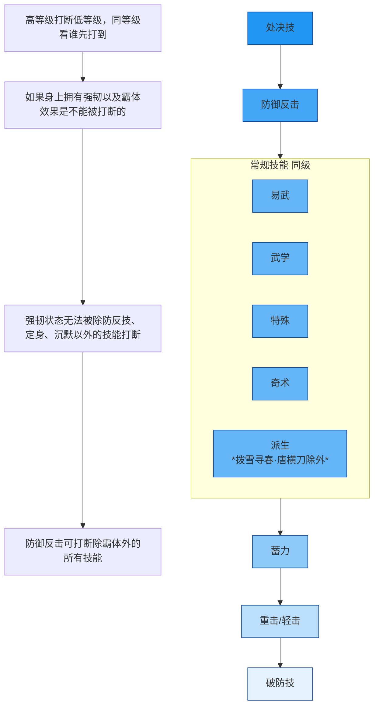
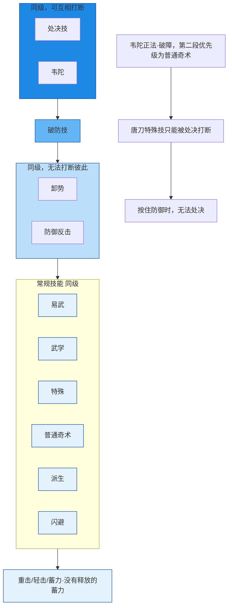

# 更新日志

| 日期       | 改动                                                         | 备注 |
| ---------- | ------------------------------------------------------------ | ---- |
| 2026-07-17 | - 0 破竹尘PVE，大外词条优化，改为三敏。增加小外词条          |      |
| 2026-03-19 | - 2.3，更新韦陀正法·破障打断优先级 - 2.5，增加全流派应对：破竹风、破竹鸢 - 2.5，增加鸣金虹反制策略，删除日月反 - 2.6，优化鹰爪连凿技巧与反制 |      |
| 2026-02-26 | - 2.2和2.3，修正补充优先级 - 2.5，增加霖霖转伞的强韧 - 2.3，优化韦陀正法·破障打断优先级 - 2.5，增加全流派应对：鸣金虹 - 2.6，完善奇术伤害倍率/损耗表，补充CD和精元 - 2.8，增加精元回复 - 4，增加牵丝玉流派养成笔记 - 5，增加鸣金虹流派养成笔记 - 6，增加破竹鸢流派养成笔记 - 7，增加PVE全天赋 |      |
| 2026-02-04 | - 0，补充连星套、时雨套、江凝套效果 - 1.2，心法大唐歌 换 怒斩马 - 1.5，增加尘镖蓄力技能详情 - 1.6，奇术使用技巧改为2.7 - 2.1，增加论剑段位介绍 - 2.5，增加全流派应对技巧(完善中） - 2.6，增加奇术伤害倍率/损耗 |      |
| 2026-01-28 | - 1.6和2.4奇术部分，修正并补充应对方法 - 1.4修正真连为伪连 |      |
| 2026-01-27 | - 1.6，完善五个奇术的技巧 - 2.4，增加全流派(除鸢鸢)技能特性 - 2.4，增加常用奇术技能特性 |      |
| 2026-01-13 | - 0PVE内容拓展 - 1.6，拓展新奇术技巧 - 2.4，新增技能特性汇总表 |      |
| 2026-01-12 | - 初次整理                                                   |      |

# 0 破竹尘PVE

[打桩输出手法](https://www.xiaohongshu.com/explore/69678fd4000000000d00ae4b?xsec_token=ABzeHtSOVNsolFIs8NwKS3082fwZZBxbClfodyf5NhQY0=&xsec_source=pc_search&source=unknown)

## 套装选择和调率

套装：PVE防具套无要求，**连星套+江凝套**，装备提供最高20%的武学技增伤(需要距离boss至少8米)。

> 连星套介绍：
> 同时命中不少于2个敌人以及命中首领或玩家时，自身获得1层连星效果:5秒内武学技造成的伤害提升3%，且武学技对距离4米外的敌人额外增伤，距离越远增伤越高，在超过8米时达到增伤最大值1%，最多可叠加5层，每受到1次伤害减少1层，每秒最多叠加2层连星。
>
> 江凝套介绍：
> 完美闪避敌人有50%概率回复自身10点耐力，同时根据当前气血值回复血量:基础回复1%气血值，自身气血值低于50%和20%时，分别额外回复2%(最高回复5%)

12条大外 +10条劲+2全武学+1伞增+2首领增伤+2精准+8会心+3敏

> 会心78+(白字145%)
> 精准100(白字130%)
>
> 大外>劲>小外
> 1劲=0.225小外+1.36大外
> 首词条可以刷出重复词条
>
> 敏两条最好，只少不能多
> 外功[1657, 4046]，理论极限
> 外功穿透X4（50，理论极限51.2）、醉梦游春增伤（27%，理论极限28）
> 绳舟没有六重前，不打响指

### 大外尘词条

| 装备 | 首词条            | 调律词条      | 定音               |
| ---- | ----------------- | ------------- | ------------------ |
| 伞   | 最大外功          | 伞增+大外+劲  | 外攻穿透           |
| 镖   | 最大外功          | 大外+劲       | 外攻穿透           |
| 环佩 | 最大外功          | 2全武+大外+劲 | 外攻穿透           |
| 冠胄 | 会心              | 大外+劲       | 醉梦游春武学技增伤 |
| 胸甲 | 会心              | 大外+劲       | 醉梦游春武学技增伤 |
| 胫甲 | 劲/会心(更推荐劲) | 首增+大外+劲  | 醉梦游春武学技增伤 |
| 腕甲 | 劲/会心(更推荐劲) | 首增+大外+劲  | 醉梦游春武学技增伤 |

### 小外尘词条

12条小外 +8条敏+2全武学+1伞增+2首领增伤+2精准+6会心+2大无相+5大破竹

| 装备 | 首词条    | 调律词条      | 定音               |
| ---- | --------- | ------------- | ------------------ |
| 伞   | 最小外功  | 伞增+小外+敏  | 外攻穿透           |
| 镖   | 最小外功  | 小外+敏       | 外攻穿透           |
| 环佩 | 最小外功  | 2全武+小外+敏 | 外攻穿透           |
| 冠胄 | 会心      | 小外+敏       | 醉梦游春武学技增伤 |
| 胸甲 | 会心      | 小外+敏       | 醉梦游春武学技增伤 |
| 胫甲 | 会心/精准 | 首增+小外+敏  | 醉梦游春武学技增伤 |
| 腕甲 | 会心/精准 | 首增+小外+敏  | 醉梦游春武学技增伤 |

[毕业率计算网站](https://yysls.leoq7.com/)

### 五维加成

| 基础属性 | 基础数值 | 影响属性   | 具体效果 |
| -------- | -------- | ---------- | -------- |
| 体       | 1        | 气血       | +60      |
| 劲       | 1        | 最小外功   | +0.225   |
|          |          | 最大外功   | +1.36    |
| 御       | 1        | 外功防御   | +0.5     |
|          |          | 气血       | +17      |
| 敏       | 1        | 会心       | +0.076   |
|          |          | 最小外功   | +0.9     |
| 势       | 1        | 最大外功   | +0.9     |
|          |          | 会心(会意) | +0.038   |

# 1 破竹尘PVP

## 1.1 装备要点

套装：**时雨+江凝套**，**连星套需要叠层**，PVP难以叠加

> 时雨套介绍：
> 造成的所有会心伤害和治疗提升10%，且在自身处于气血护盾状态时额外提升15%。
>
> 江凝套介绍：
> 完美闪避敌人有50%概率回复自身10点耐力，同时根据当前气血值回复血量:基础回复1%气血值，自身气血值低于50%和20%时，分别额外回复2%(最高回复5%)

1. **佩·定音尘镖蓄力技**：<蓄力技：镖鸣彻野>，尘镖蓄力技命中1.5秒强韧（弱于霸体）。
2. **环·定音武学技扔伞**：带强韧，注意把控CD，用于走位博弈。  
3. **环·定音尘伞吸附可附加真气伤害**，可尝试 **吸附+处决**。
4. **尘镖 buff 效果**：挂上后，对方真气条变黄时伤害提高，且真气清除速度加快。

| 装备 | 定音                                                         | 备注                         |
| ---- | ------------------------------------------------------------ | ---------------------------- |
| 武器 | 1.使用处决技后可使自身恢复30点精元，并恢复伤害量20%的气血值 2.使用防御反击技命中未处于防御状态的单位时，额外造成15点真气伤害，并恢复自身5点真气 | 主副武器同样的定音效果不叠加 |
| 环佩 | 环·定音扔伞 佩·定音尘镖蓄力技<蓄力技：镖鸣彻野>          | 根据武学流派变化             |
| 冠胄 | 解除受击或者受控制状态时，获得2.8秒的强韧效果                |                              |
| 胸甲 | 自身处于受击状态时，受到的伤害降低28%                        |                              |
| 胫甲 | 1.闪避成功抵消敌方攻击后，使自身恢复20点真气，触发间隔10秒 2.闪避成功抵消敌方攻击后，使自身恢复8%最大气血，触发间隔10秒 |                              |
| 腕甲 | 1.卸势成功时，使自身恢复16点真气，触发间隔10秒               |                              |

---

## 1.2 心法 + 奇术
- 千营一呼
- 易水歌 换 婆娑影
- 绳舟行木
- 大唐歌 换 怒斩马(增加博弈)

必带：清风霁月、药叉破魔、骑龙回马

推荐：神龙吐火+太白醉月+阴阳迷踪步+金蟾腾跃+金玉手

可选：凌云踏+韦陀正法

---

## 1.3 开局起手
开局索敌 + 喝酒 + 尘镖武学(挂摄魂，强化尘镖蓄力技) → 卸势打断

> 如果对手是玉玉，在放抛春恨就不要喝酒

---

## 1.4 连招

### 连招一(伪连，骑龙可卸)
喝酒 → 尘镖蓄力技 → 骑龙回马(可被卸势) → 尘镖武学技 → 尘镖蓄力技 → 响指 → 尘伞武学技 → 尘伞特殊技 → 处决 → 吐火(火烧到对面身上立马点卸势打断)

### 连招二
喝酒 → 尘镖蓄力技 → 尘伞武学技 → 尘镖武学技 → 响指 → 尘伞武学技（一下） → 尘伞特殊技换位(定音环) → 处决 → 吐火(火烧到对面身上立马点卸势打断)

> 吐火后提前卸势 或 位移拉远，避免被反抓僵直。

---

## 1.5 技能衔接与技巧

### 尘镖相关
- 尘镖蓄力技不打最后一段，可接 **自在无碍**。
- 尘镖蓄力技 + 尘镖武学技
- 尘镖蓄力技第一段（横扫拉近敌人）+ 蛤蟆（变体）
- 尘镖蓄力技过程中 + 吐火（利用霸体强顶对方霸体，防被连）
- 尘镖处决后可接一套蛤蟆
- 骑龙回马 + 尘镖武学技
- 尘镖挂满 buff 的响指有击飞效果，可顺势接尘伞打伤害
- 根据蓄力时长会获取不同的效果:持续1.5秒:下一次蓄力技镖鸣彻野获得强化，每段伤害容易对敌人造成更大的受击硬直。持续3秒:自身缓慢回复生命，特续至蓄力姿态结束。持续4.5秒:自身缓慢回复真气，持续至蓄力姿态结束。

### 尘伞相关
- 尘伞共鸣（20秒仅触发一次，聚拢效果）可断金光骑龙回马
- 尘伞扔伞后，快速切换尘镖蓄力（霸体），防被抓僵直
- 尘伞不接伞 + 药叉破魔（沉默对方）
- 尘伞换位 + 药叉破魔（沉默对方）
- 尘伞被卸势时，自己也卸势，可打断对方卸势节奏
- 尘伞两段换位 或 尘伞特殊技 + 卸势，用于拉扯
- 尘伞特殊技最后一段需卸势下伞，否则易被抓僵直

# 2 PVP

## 2.1 名词解释

### 状态类

1. **受击**：被对手攻击且无法反击时的状态。
2. **强韧**：自身拥有强韧效果时，对手的技能无法让你进入受击状态（除控制技能外）。
3. **霸体**：自身拥有霸体效果时，对手的任何技能都无法让你进入受击状态。
4. **控制**：被定身，无法使用除解控外的任意动作和技能时的状态。
5. **沉默**：无法使用除解控外任意技能时的状态（可以移动）。
6. **破防**：在防御和卸势状态下被破防奇术命中，或是在耐力不足情况下防御被攻击。
7. **气竭**：血条下方的蓝色真气槽被清空后的状态。

### 动作类

1. **真连**：通过连招不断攻击对手，此时对手无法使用除解控外的任何技能。
2. **伪连**：通过连招不断攻击对手时，对手通过卸势或者闪避中断了你的连招。
3. **喝酒**：使用奇术“太白醉月”后会喝一口酒，可提前用卸势打断。
4. **快火**：喝酒后使用“神龙吐火”，可跳过喝酒动作直接吐火。
5. **慢火**：未提前喝酒时使用“神龙吐火”，会先展示喝酒动作然后再吐火。
6. **解控**：可以解除受击、控制、沉默状态。
7. **卸势**：卸势成功时将抵消伤害并削减对手真气，卸势会消耗自身耐力。
8. **防御**：防御会大幅降低受到的伤害，但会消耗自身耐力。
9. **格反**：防御对手攻击后，可以使用防守反击打断对手的动作。
10. **黄光骑龙**：被对手攻击到的瞬间使用“骑龙回马（5重）”。
11. **反骑龙**：被对手“骑龙回马”打中前的瞬间，使用“骑龙回马（5重）”。
12. **后长闪**：不按任何方向键的时候按下闪避键，角色将作出后跳动作。
13. **处决**：当对手处于气竭状态时，使用处决按钮。
14. **慢处决**：当对手触发“守关元”时，等待1-2秒再处决，可跳过其无敌状态。
15. **处决吐火**：处决后马上使用“神龙吐火”。
16. **快跑**：闪避后一直按方向键进入快跑状态，期间会不断消耗耐力。
17. **跑狗**：以远程消耗为主，一直与你拉开距离或拖延时间的战斗方式。
18. **跑a**：快跑时使用普通攻击。
19. **闪a**：闪避后使用普通攻击。
20. **q1q2**：Q为PC端武学技的按键，q1q2即为快速按两下武学技。
21. **r1r2**：R为PC端重击/蓄力的按键，r1r2即为快速按两下重击。
22. **a1a2**：a为普通攻击键，a1a2即为普通攻击两下。

### 简称

1. **蛤蟆**：代表奇术金蟾腾岳
2. **点剑**：无名剑法的武学技，远程第一段
3. **燕反**：无名剑法的特殊技，特殊技第一段
4. **大砸**：无名剑特殊技第二段
5. **钻头**：双刀泥犁三垢的武学技
6. **老鼠**：绳镖栗子游尘召唤出的鼠鼠。

### 段位

出鞘、仗剑、游刃、开山、断水、

斩风、流云、藏锋、飞花、无我。

一共10个段位，每个段位3个阶段

## 2.2 打断对方技能优先级

抛春恨乾坤定，防反无名枪定音以及凌云踏，可以造成僵直霸体

## 2.3 打断自身技能优先级

> ###### 定身技如乾坤定和唐刀特殊以及玉玉挑飞的优先级仅低于处决，韦陀也没法打断
>
> 易武技也只能被处决打断

奇术「韦陀正法」第六重突破效果修改为使常规分支伤害能破除敌方强韧状态，但伤害与打断优先级降低，也不可接续其他技能硬直。若前两掌成功破除强韧状态，还可无消耗再次释放常规分支。相应的，调息时间增加10秒。此调整将于先琢版本结束后以奇术新悟的形式解锁。

## 2.4 技能特性汇总表

### 武学流派

- 玉玉/无名没有强韧或者霸体
- 鸢鸢未整理

| 流派        | 武器 | 技能类型                                              | 触发条件/效果 | 状态         |
| ----------- | ---- | ----------------------------------------------------- | ------------- | ------------ |
| **钧钧**    | 唐刀 | 特殊技                                                | 基础效果      | 强韧         |
|             |      | 轻击蓄力                                              | 非止戈状态    | 强韧         |
|             |      | 重击派生                                              | 卸反效果      | 强韧         |
|             |      | 轻击派生                                              | 基础效果      | 强韧         |
|             | 钧陌 | 特殊技                                                | 基础效果      | 强韧         |
|             |      | 武学技释放3秒后                                       | 时间触发      | 强韧         |
|             |      | 特殊定音下荡八荒释放后3秒                             | 定音+时间     | 强韧         |
| **尘尘**    | 尘伞 | 特殊技                                                | 基础效果      | 强韧         |
|             |      | 武学技                                                | 非止戈状态    | 强韧         |
|             |      | 武学技，特殊定音下                                    | 额外效果      | 强韧         |
|             | 尘绳 | 特殊技响指                                            | 基础效果      | 强韧         |
|             |      | 武学技                                                | 非止戈状态    | 强韧         |
|             |      | 蓄力姿态                                              | 基础效果      | 强韧         |
|             |      | 特殊定音下蓄力命中                                    | 定音+命中     | 强韧         |
| **威威**    | 威陌 | 特殊技                                                | 基础效果      | 强韧         |
|             |      | 特殊定音下                                            | 延长强韧      | 强韧         |
|             |      | 特殊定音下命中2人及以上                               | 人数条件      | **霸体**     |
|             |      | 蓄力                                                  | 基础效果      | 强韧         |
|             |      | 防反派生                                              | 基础效果      | 强韧         |
|             |      | 特殊定音下武学技                                      | 定音触发      | **2秒霸体**  |
|             | 八枪 | 蓄力技                                                | 基础效果      | 强韧         |
|             |      | 武学技                                                | 基础效果      | 强韧         |
|             |      | 特殊技                                                | 基础效果      | 强韧         |
|             |      | 特殊定音下                                            | 定音触发      | **2秒霸体**  |
| **风风/99** | 风绳 | 蓄力技                                                | 基础效果      | 强韧         |
|             | 双刀 | 开红                                                  | 基础效果      | 强韧         |
|             |      | 特殊定音下特殊技                                      | 定音触发      | 强韧         |
|             | 九枪 | 蓄力技                                                | 基础效果      | 强韧         |
|             |      | 武学技                                                | 基础效果      | 强韧         |
|             |      | 逐狼心经装备                                          | 效果增强      | 强韧         |
|             |      | 特殊定音下特殊技命中                                  | 定音+命中     | 强韧         |
| **霖霖**    | 霖伞 | 特殊定音下武学技命中                                  | 增益自己      | **自己霸体** |
|             |      | 特殊定音下蓄力技(PVP无人用)                           | 增益自己      | 自己强韧     |
|             |      | 霖伞武学技转伞 强韧冷却60s，持续6s，武学技冷却30s | 基础效果      | 强韧         |
|             | 霖扇 | 特殊定音下重击命中队友                                | 增益队友      | 队友强韧     |
|             |      | 特殊定音下特殊技命中队友                              | 增益队友      | 队友强韧     |
|             | 奇术 | 同时装配千香引魂蛊和明川药典，奇术增伤20%             |               |              |

## 2.5 全流派应对技巧

### 优先应对策略

| 流派   | 最优策略     | 原因概要                                                     |
| ------ | ------------ | ------------------------------------------------------------ |
| 鸣金虹 | 主闪避       | 枪乾坤定极快，且仅能闪；剑易武大僵直，起手极快；剑挡反起手较快； |
| 鸣金影 | 主闪避       | 其血爆技能会破除格挡和卸势。                                 |
| 牵丝玉 | 格挡         | 用卸势会被点穴挑飞；用闪避会被挑飞吸闪；用“太白”后摇大会吃解控抛春恨。 |
| 牵丝霖 | 主闪避       | 其输出均为抬手较长的奇术，且常隐藏“药叉”技能。               |
| 破竹风 | 主卸势和顶招 | 红刀期间顶招。其它除强化鼠、挡反，优先卸势。                 |
| 破竹尘 | 主卸势和顶招 | 容易卸势，且强韧技能伤害不高，可以顶招                       |
| 破竹鸢 |              |                                                              |
| 裂石威 |              |                                                              |
| 裂石均 |              |                                                              |

### 鸣金虹/无名

#### 无名剑

**1. 基础攻击与技能**

- **轻攻击**：共4段，均为小僵直。其中“一A二A”为真连招。
- **重攻击**：共3段，第二、三段为大僵直。
- **易武技**：两段伤害，大僵直，近距离，为主要抓人技能。
- **防反**：两段伤害，第一段快，第二段慢。
- **武学技**： **一段（远）**：突进，可卸势打断。释放时人物不动，仅飞剑。大僵直。 **一段（近）**：快速前冲。大僵直。 **二段**：两次伤害，大僵直。 **三段**：三次伤害，大僵直，**同时生成真气护盾被打不掉真气**。
- **特殊技**： **一段**：一次伤害，小僵直。 **二段**：两次伤害，大僵直。
- **蓄力技**： 默认发射一道剑气。 **机制**：拥有真气护盾时，或释放特殊技后（需一重心法），可释放三道剑气。 **六重心法**：释放多段剑气后获得“气涌”状态，5秒内无需蓄力可再次瞬发三道剑气。 **打断优先级**：蓄力技本身有固定优先级，“气涌”派生技则遵循派生技的优先级规则。

**2. 卸势点与闪避点**

- **武学技一段（远）**：对手甩右胳膊、低头时。
- **武学技一段（近）**：对手弯腰时。
- **武学技二段**：只能与一段一起卸，时机为对手挥胳膊时。
- **武学技三段**：看对手胳膊动作，节奏为“两快一慢”。闪避则需连续闪避，有轻微吸附。
- **特殊技一段**：对手跳起时。不建议观察剑气（有假剑气）。若对手卸势特殊技后摇，就卸势或闪避。
- **特殊技二段**：对手下砸时（此招较少用）。
- **蓄力技（一道剑气）**：亲吻膝盖动作时卸势或闪避。
- **蓄力技（三道剑气）**：剑气快到时，“快卸两下，慢卸第三下”。闪避需“前闪接后闪”。高延迟时可观察对手人物动作。
- **蓄力技-气涌**：对手有气涌标志并突然秒弯腰时，时机同三道剑气。高延迟或不自信可连续绕圈闪避。
- **易武技**：对手改其它武器时突然弯腰，需**连续卸势两下或闪避**。此招起手快，需警惕。
- **防反技**：看到金光，**前闪一下后立刻反向再闪一下**。简易处理：见金光直接侧闪。

------

#### 无名枪

**1. 基础攻击与技能**

- **轻攻击**：共4段，仅最后一段挑飞为大僵直，其余为小僵直。
- **重攻击**：共3段，均为大僵直（因速度慢，使用率低）。
- **易武技**：两段伤害，小僵直（僵直太小，使用率低）。
- **防反**：一段伤害，距离远，使用率高。
- **武学技**：一段伤害，**可定身非霸体目标2秒**，具有吸附性。
- **特殊技**：一次伤害，小僵直，具有吸附性。
- **蓄力技**：前2秒无僵直，2秒后转速起来产生僵直。旋转期间**可免疫弹道伤害（“抛春恨”除外）**。

**2. 卸势点与闪避点**

- **武学技**：看到对手抬左手闪金光时立即闪避（前闪最稳定）。
- **特殊技**：看到对手向前冲刺时，卸势或闪避一次即可。
- **蓄力技**：前2秒无僵直，了解即可（实战较少用）。
- **防反**：对手**抬腿时**闪避。若看不清，可记对手身上闪光，**等个半拍(等闪光消失瞬间闪)**，再闪避。
- **易武技**：双方距离约两个身位时，对手弯腰卸势一下即可。脸贴时难以反应，但因其僵直小无法衔接连招，被打中影响不大。

------

#### 常见定音

- **环（乾坤定延长定身）**：延长控制技能的定身时间，足以打满“骑龙”等技能伤害。
- **环（乾坤定减CD效果）**：定住敌人可**减少自身解控技能5秒冷却**，配合冷却缩减装备(头)，解控CD可缩短至19秒。
- ~~**环（乾坤定受击定身）**：在自身受击时使用“乾坤定 · 感知技”，可**定身对手0.5秒**，作为反制手段。~~

#### 补充

- 燕反（无名剑特殊技第一段） 
- 大砸（无名剑特殊技第二段） 
- 点剑（无名剑武学技远程第一段）
- 乾坤定（无名枪武学技）
- ~~日月反（无名枪武学技 · 感知技，自身处于受击状态下，可以释放定身对方）~~

---

#### 反制策略

**核心特点**

- 无名**没有强韧/霸体**

- 直线攻击/手段单一，主要依赖：
  1. **点剑**：无名剑远程第一段，主要远程消耗手段
  2. **乾坤定**：无名枪武学技，带控制效果
  3. **燕反**：无名剑特殊技第一段
- **战术选择**：多数无名玩家倾向 **“打跑虹”**（即游走消耗）。

**核心策略**

1. **不要被“点剑”点到**
2. **不要被“乾坤定”定到**

**常见打法与思路**

- **跑虹反制**

  - **跑虹策略**：不主打连招，依靠**持续的远程拉扯（主用“点剑”）** 进行消耗，给对手施压。

  - **跑虹奇术**：点穴/凌云踏、阴阳迷踪步(减少耐力损耗)、无相金身(恢复真气)

  - **应对策略**：给予压力，**耗光对手耐力**

- **剑气反制**

  - **无名策略**：有气涌时，逼近对方。通常先用“点剑”或“燕反”进行干扰，然后立马剑气。有些不会释放完整三段，怕对方会卸。

  - **应对策略**：尽量拉远，为自己争取反应时间。警惕第2、3段剑气，以防突然变招为破防技(完闪/骑龙等应对)

- **乾坤定反制**

  - **无名策略 · 切枪近身**：当用完“点剑”和“燕反”后，主动切枪来靠近，极高概率准备使用“乾坤定”

  - **无名策略 · 骗招反击**：持剑以格挡姿态缓慢靠近，引诱你出手并利用你的武学后摇。立刻切枪接“乾坤定”

- **~~日月反反制~~**

  - ~~在受击状态下才会出现。观察受击无名的手持武器(受击时可以切换)。如果他从剑**切换回了枪**，准备闪避~~

- **凌云踏+剑气反制**

  - **无名策略**：凌云踏拉近距离 -> 跳一下打断，跃至你周围 -> 落地释放气涌

  - **应对策略**：尽量拉远，为自己争取反应时间

- **凌云踏+乾坤定反制**

  - **无名策略**：
    - 凌云踏->发现对方未格挡->下劈->乾坤定->无名剑特殊技
    - 凌云踏->发现对方格挡->千斤坠->乾坤定->无名剑特殊技

  - 应对策略：
    - 看到无名**持枪跳起（凌云踏）**，直接闪避拉开
      - 如果选择格挡，对方使用“千斤坠”时**立刻闪避**；如果对方没有用千斤坠，则可用**格挡反击**来打断其后续的“乾坤定”。

- **藏药叉**

  - 点剑：在**手甩出去的那一刻**释放药叉，而非剑飞出去时

  - 燕反：释放剑气（或不释放）之后，衔接药叉

  - 武学技第三段：在第三段伤害期间，插入药叉

---

### 鸣金影

---

### 破竹风

#### 双刀

**1. 基础攻击与技能**

- **轻攻击**：共4段，造成7次伤害，均为小僵直。a3节奏一致，a4慢刀。
  - 第一段：带小吸附。
  - 第四段：带吸附效果，是主要抓人手段之一。
- **武学技**：可储存3次，共6段伤害。**大僵直**，起手较快。
- **特殊技**：有三种派生形式。可立刻再次触发，为派生1。双刀收回后触发，为派生2：
  - **基础**：丢出短刀，6段伤害，小僵直。
  - **横斩（派生1真连）**：丢出短刀，结尾横斩六段，6段伤害，**大僵直**。
  - **十字斩（派生2伪连）**：丢出短刀，结尾十字斩，8段伤害，**大僵直**。
- **蓄力技**：红条满后可开启**嗔焰状态**，获得**强韧**效果。此状态下轻攻击改为5段，共21次伤害（小僵直，但起手快）。
- **易武技**：2次伤害，**大僵直**。
- **防反技**：1次伤害，速度较慢，距离较近。

**2. 卸势点与闪避点**

- **轻攻击**：
  - **时机**：看到对手举胳膊下落的动作时卸势（需**连续卸势五下**）。双刀轻击为快慢刀，闪避时机与卸势点相同。
  - **注意**：第一刀有小吸附；第四刀（吸附刀）看到对手**弯腰前冲**时卸势或闪避。
- **武学技**：
  - **中远距离**：看到对手冲过来，卸势三下左右（建议多卸一下，小心破防技）。
  - **近距离**：卸势四下左右（同样建议多卸一下）。
  - **闪避**：时机点相同。高延迟玩家建议多靠闪避，谨慎卸势，容易藏破防技。
- **特殊技**：
  - **翻身踢腿（基础）**：卸势三下，闪避时机相同（此招使用少）。
  - **横斩（派生1）**：卸势四下。
  - **十字斩（派生2）**：卸势四下。
- **防反技**：观察到金光时闪避即可。
- **易武技**：对手快落地时**快速卸势两下**，闪避时机相同。
- **蓄力技（开红刀强韧）**：能预判（目押）则尝试，否则建议直接躲闪，暂避锋芒。

---

#### 风镖

**1. 基础攻击与技能**

- **轻攻击**：共4段，造成8次伤害。其中**轻击第二段、第四段为大僵直**。

- **武学技**：可释放2次。
  - **一段**：将敌人拉近，3段伤害（小僵直），并为对手**挂上“仇杀令”**和**鼠鼠追命**（配合心法持续20秒，结束后结算期间老鼠造成伤害的30%）。期间，若再次吃到武学技一段，可以提前结算**鼠鼠追命**伤害
  
- **特殊技**：

  - **直接释放**：攻击时附带老鼠协同攻击。

  - **蓄力强化后**：释放时会额外召唤**强化鼠**自动贴近攻击，**强化鼠不可被卸势**。

- **蓄力技**：

  - **过程**：释放期间获得1.5秒强韧 → 强化特殊技（持续3秒） → 开始回血（持续4.5秒） → 开始回真气。

  - **派生**：蓄力中可用轻击（1次伤害）或重击（2次伤害，大僵直，可将对手拉至身边）。

- **易武技**：1次伤害，小僵直。

- **防反技**：1次伤害。

**2. 卸势点与闪避点**

- **武学技**：右腿前踢时，闪避时机相同。**注意：防御也会被挂上“仇杀令”**。

- **特殊技**：
  - **普通鼠**：老鼠快近身时卸势，闪避时机相同。鼠鼠协同卸势7-8次，可以气竭，但容易空耐力。
  
  - **强化鼠**：**不可卸势**，但可闪避（时机同普通鼠）。强化鼠自带金光易分辨，**拉开距离脱离其范围便不再产生**。
  
- **蓄力技**：其轻击和重击派生都很快。强韧金光消失时卸势，重击派生有两段，伪连。

- **防反技**：观察到金光时闪避。

- **易武技**：对手跳起转身时卸势或闪避。

- **带老鼠的双刀武学技**：卸势/闪避点与普通双刀武学技没有区别。

---

#### 常见定音

- **环**：武学技命中真气低于30%的单位时，增加处决伤害
- **佩 (效果1)**：双刀轻击命中敌人时，叠加一层增伤效果，最多三层。

- **佩 (效果2)**：开启红刀（嗔焰）时，增加真气伤害。轻击命中三次以上，可减少武学技3秒冷却时间。

---

#### 反制策略

**核心特点**

- 主要伤害**鼠鼠的协同攻击**
- **强韧状态**：**风镖蓄力、双刀开红、双刀特殊技定音**
- **爆发技能**：**“鼠鼠追命”** 期间，额外结算其老鼠攻击30%的伤害

**核心策略**

1. **核心规避**：不要吃**风镖武学技一段(仇杀令和鼠鼠追命)**，增加鼠鼠协同50%伤害和20s后结算30%老鼠伤害
1. **警惕鼠鼠受击**：由于鼠鼠协同，更容易被连续受击，注意走位，易释放出**金骑龙**。
1. **避免高伤**：**鼠鼠追命**期间，少吃伤害。
1. **警惕近距离后摇**：**A4是真连**，常见于抓技能后摇

**常见打法与思路**

- **风镖蓄力强韧**

  - **风风策略**：强韧拉近距离后，接蓄力派生技，大僵直。蓄力技可瞬切防御。

  - **应对策略**：
    - **破强韧**：使用**凌云踏、韦陀正法等可破强韧的技能**进行反制。
      - **拉距离**：消耗其耐力，等待其强韧结束。风镖武学技、蓄力技派生技距离12m。

- **红刀输出**

  - **风风策略**：开红后获得强韧，进行高频率输出

  - **应对策略**：
    - 远距离：**三段跳滞空躲避（红刀未命中时持续时间很短）**。但可能被**金玉手技能击落**。
      - 稳妥方案：看到开红动作，立即喝酒（或提前保持醉拳状态）。采用**醉拳一下接卸势一下**的循环，利用醉拳的强韧效果对抗其强韧攻势。

- **红刀鹰抓**

  - **风风策略**：红刀有强韧，对方会卸势。此时释放鹰抓破防对方，由于处于红刀期间，有强韧效果，不可被抓鹰抓后摇。

  - **应对策略**：看到开红动作，立即喝酒（或提前保持醉拳状态）。采用**醉拳一下接卸势一下**的循环，利用醉拳的强韧效果对抗其强韧攻势。

---

### 破竹鸢

#### 手甲

**1. 基础攻击与技能**

- **轻攻击**：共6段，造成8次伤害，均为小僵直。
  - 第五段、第六段：有**吸附效果**，是主要抓人手段之一。
  
  - 第六段：命中后会**召唤鹰进行攻击**，并可衔接技能。
  
- **重攻击**：共4段，造成6次伤害。
  - 重击一段：有吸附效果。
  
  - **大僵直段**：第一段、第三段、第四段。
  
- **武学技**：

  - **一段**：2次伤害，**大僵直**。 **远距离释放**：冲刺过程有强韧，下落时无。 **近距离释放**：无强韧。 **技巧**：可用于抓对手闪避后摇。 **接续**：接轻击从第1段轻击（1A）开始。

  - **二段**：5次伤害，**大僵直**。 **特性**：转身后撤时有短暂**无敌帧**。 **接续（需手甲金色心法一重）**：接轻击从第5段轻击（5A）开始。

- **特殊技**：4次伤害，**大僵直**，起手速度很快。**接续（需手甲金色心法一重）**：接轻击从第5段轻击（5A）开始。

- **蓄力技**：

  - 消耗至少2格“天志”释放，天志越多伤害越高。

  - **特性**：释放时人物不可移动，攻击**不可防御、不可卸势**。

  - **弱点**：释放时不附带强韧，**可被打断**。

- **易武技**：起手快，2次伤害，**大僵直**。

- **防反技**：1次伤害，中规中矩。

- **闪避反击**：2次伤害，**大僵直**。释放期间对手**只能卸势，不能闪避**。

**2. 卸势点与闪避点**

- **轻攻击**：
  - **第五段**：看到对手前冲时，卸势两下。 
  - **第六段**：看到对手前冲时，卸势四下。 
  - **建议**：高延迟或难以预判时，建议直接防御或闪避（需注意破防技）。
- **重攻击**： 
  - **第一段（带吸附）**：对手前冲回左拳时卸势或闪避。
- **闪避反击**：对手处于无敌帧向我方冲刺时，**连续卸势两下或闪避**。 **注意**：卸势时需小心破防技。其锁定机制与鹰抓连招类似。
- **武学技**：
  - **一段**：对手下砸时卸/闪一下。远/近释放点相同。
  - **二段**：对手后撤步时，**连续卸势四下**；或**闪避一下**（最好**后闪**）。
- **特殊技**：对手扎马步时，**连续卸势3-4下**；或**侧闪**（不可后闪）。
- **易武技**：对手右踢腿时，**连续卸势两下或闪避**。
- **蓄力技**：看到金光时闪避。
- **防反技**：看到金光时闪避。

---

#### 鸢镖

**1. 基础攻击与技能**

**镖的轻击、易武、防反都是通用的**

- **特性**：**鸢镖没有蓄力技**。

- **重攻击**：

  - **使用“天志”**：14次伤害，**大僵直**。中途衔接手甲易武技为**真连招**。

  - **不使用“天志”**：14次伤害，小僵直。中途衔接手甲易武技为**伪连招**。

- **武学技**：

  - **不带“擒天势”心法**：3次伤害，**大僵直**。

  - **携带“擒天势”心法**：6次伤害，**大僵直**。

- **特殊技**：

  - **不带“擒天势”心法**：1次伤害，**大僵直**。

  - **携带“擒天势”心法**：2次伤害，**大僵直**。

**2. 卸势点与闪避点**

**镖的轻击、易武、防反，卸点闪点**

- **武学技**：

  - **不带“擒天势”**：对手右手前抛时，**慢速卸势两下**；闪避同理，需**闪避两下**。

  - **携带“擒天势”**：对手右手前抛时，**连续卸势四下**；闪避需两下。

- **特殊技**：
  - **不带“擒天势”**：鸢镖收紧时，卸势一下；闪避时机相同。

  - **携带“擒天势”**：鸢镖收紧时，**快速卸势两下**；闪避一下即可。

- **重攻击**：

  - 对手左右摇晃绳镖时，**尽可能快地连续卸势**（无论是否使用天志，时机点相同）。

  - **更建议**：直接闪避或防御。

---

#### 常见定音

- **环 (效果1)**：对手装备此定音后，我方在其**特殊技“天下归义”期间无法通过解控进行反打**。
  - **天下归义（特殊技）效果**：命中处于强韧状态的单位时，自身获得1.5秒强韧并回复15点真气，每15秒触发一次。
- **环 (效果2)**：需注意，即使武学技被卸势，也能触发以下增益。
  - **飞来势（武学技）效果**：命中未处于防御状态的目标时，使目标10秒内受到伤害提升10%，同时自身获得3秒强韧效果。
- **佩**：核心伤害加成方式之一。
  - **天欲义（手甲轻击）效果**：每次命中未防御的目标，为其叠加一层易伤，每层使目标12秒内受到伤害增加2%，最多叠加4层，每1秒只能叠加一次。

---

### 破竹尘

#### 尘镖

**镖的轻击、易武、防反都是通用的**

- **蓄力技**：

  - **蓄力效果**：蓄力1.5秒→强化蓄力技；蓄力3秒→回复生命；蓄力4.5秒→回复真气。**所有蓄力技都可为敌人附加“失魂”状态**。

  - | 消耗恩字牌    | 伤害段数   | 僵直类型                        |
    | ------------- | ---------- | ------------------------------- |
    | 0个 或 1个    | 3段 或 5段 | **小僵直**                      |
    | 2个           | 7段        | 前6段小僵直，**第7段大僵直**    |
    | 2个（强化后） | 7段        | 前5段小僵直，**第6、7段大僵直** |

- **武学技**：3段伤害，小僵直。

  - **效果**：释放后**自动接续蓄力技**，并进入**摄魂状态**。

- **特殊技（效果取决于目标状态）**：

  - **目标有“失魂”**：造成击退，1段伤害，**大僵直**，附带5秒减速。

  - **目标有“失魂落魄”**：造成击飞，1段伤害，**大僵直**，刷新“失魂落魄”状态（需绳舟行木六重心法），附带5秒减速。

  - **状态机制**：“失魂”叠加7层后变为“失魂落魄”（真气条变色）。期间目标受伤提升5%并额外受5%真气伤害；状态结束时，结算期间所受总伤害的5%作为额外伤害（需绳舟行木心法）。

**2. 卸势点与闪避点**

**镖的轻击、易武、防反，卸点闪点**

- **蓄力技**：对手蓄力时强韧消失，动作弯腰开始卸。注意第六下和第七下出手越来越慢，结尾是有一个放慢的小变奏的。闪的点同理。高延迟目押不好的，尽量选择防闪防御或者直接打防反。
- **武学技**：总共卸三次。对手挥右手卸一，慢卸二三。闪的点同理
- **特殊技**：不能卸，可以防/闪，但是会吃到伤害和减速，而且会刷新失魂落魄。

- **蓄力技**：
  - **时机**：对手蓄力强韧结束，动作弯腰时开始卸势。
  
  - **注意**：卸势节奏需注意，第6、7段出手较慢，结尾有放慢的变奏。闪避时机相同。
  
  - **建议**：高延迟或预判困难时，优先选择防御、闪避或打防反。
  
- **武学技**：共需卸势三次。对手**挥右手时卸第一下**，随后**慢速卸第二、三下**。闪避时机相同。

- **特殊技**：**不可卸势**。可防御或闪避，但仍会受伤并附加减速，且会**刷新目标的“失魂落魄”状态**。

---

#### 尘伞

**1. 基础攻击与技能**

**伞的普攻、易武、轻击，同玉玉**

- **蓄力技**：2段伤害，大僵直。

  - **效果**：命中敌人时在其身后生成**幻影伞**；未命中则在最远位置生成。

- **武学技**：

  - **伤害**：丢伞3段（大僵直）+ 每把幻影伞2段伤害 + 其它幻影伞1段伤害。

  - **效果**：命中敌人后在其身后留下**幻影伞**。**每20秒有一次吸附效果**，可打断“金骑龙”等状态。

- **特殊技**：11段伤害，大僵直。

  - **效果**：若存在幻影伞，可与之**换位**，并在5秒内可进行**第二次换位**。

**2. 卸势点与闪避点**

- **武学技**：对手丢伞时**连续卸势两下**。也可防御，闪避时机相同。
  - **关键**：闪避后**建议接一次卸势**，否则可能被尘伞武学技的20秒吸附效果拉回。
- **特殊技**：对手上伞时**开始连续卸势**（卸势时需注意破防技）。闪避时机相同。
- **蓄力技**：应对点与武学技类似，但实战中使用率低。

---

####  常见定音

- **环**：武学技命中未防御的敌人时，回复“残红”，自身获得2秒强韧，每3秒触发一次。
  - **对应技能·红绡香断**：在“葬花”状态下对未防御目标造成伤害，额外回复半朵“残红”，并获得2秒强韧，每3秒触发一次。
- **佩**：尘镖蓄力技每命中一个单位，获得0.6秒强韧（最多5人）。若命中时目标处于强韧状态，则强韧时间翻倍。每15秒触发一次。
  - **对应技能·镖鸣彻野**：同上。

---

### 牵丝玉

#### 玉扇

**1. 基础攻击与技能**

- **轻攻击**：共四段，仅第四段攻击带僵直
- **轻蓄力**：单次伤害，可将对手**击飞**
- **重攻击**：三段，共五次伤害，均为小僵直，使用较少
- **重蓄力**：两段伤害，造成**大僵直**，常被**用作位移手段**
- **突进技**：造成3~4次伤害与**大僵直**，是常用的**抓人或“抽奖”起手技能**
- **武学技**：
  - 一段伤害并赋予自身**“乘风”**效果，可充能两次
  - **可打断破防技**，**后空翻时算闪避状态**

- **特殊技**：
  - 造成两段伤害，释放后**5秒内**可再次施放以**返回原位**，**可打断破防技**
  - **派生技(普通)**：三次伤害
  - **派生技(乘风效果)**：五次伤害
  - 注意：所有能造成**击飞**的效果均可**衔接派生技**。

- **易武技**：两段伤害，没有僵直，但起手速度很快
- **防反技**：单次伤害，攻击距离非常远

**2. 卸势点与闪避点**

- **轻攻击**：在**扇子抬手**时进行卸势或闪避，需注意其第四下攻击出手稍慢
- **轻蓄力**：在风快要打到身上时卸势或闪避
- **重攻击**：较少使用
- **重蓄力**：对手**起跳**时，需要快速卸势两次，或闪避一次
- **突进技**：**转身起跳**时卸势或闪避。建议左右闪
- **武学技**：**划右手抬腿**动作时闪避或卸势，该动作较难“目押”，建议直接防御。
- **特殊技**：**弯腰半蹲**时卸势两下或闪避一下。更稳妥的方式是“防卸”、“防闪”或直接使用防反技应对
- **防反技**：出金光时闪避
- **易武技**：在对手**划左手**时卸一下，在**转身划右手**时卸第二下，闪同理。第一下伤害过快，建议直接防

------

#### 玉伞

**1. 基础攻击与技能**

- **轻攻击**：共四段，**仅第四段带僵直**
  - 派生技（鼠标左键再按R键）：较少使用

- **轻蓄力**：有耐力可在空中一直攻击，并能自行选择攻击落点
- **重攻击**：四段，共七次伤害，使用较少
  - 派生技（按R键再按鼠标左键）：通常用来攒繁花，或者定人后，没精元时打伤害

- **重蓄力**：共两次伤害，第二段伞伤害是**大僵直**
- **伞浮空**：在空中消耗耐力悬停，可用于避战（**凌云踏**可破）
- **武学技**：一段伤害，不可防御与卸势，可定身对手3秒，搭配“定音”效果可延长定身时间
- **特殊技**：在“繁华”达到50%以上时可释放，伞会自动攻击
- **易武技**：两次伤害，无僵直效果
- **防反技**：一段伤害，出手较慢

**2. 卸势点与闪避点**

- **轻攻击**：**观察飞行物**快打到时卸或闪
- **轻蓄力**：需要**快速卸势**，虽然容易漏卸，但对手会因此消耗真气，抓住机会卸掉几下后便可近身处决
- **重攻击**：较少使用
- **重蓄力**：较少使用
- **武学技**：**观察飞行物**，快到时闪，因飞行距离不同，闪避时机需视弹道而定
- **特殊技**：**观察飞行物**，在其快到时，卸或闪，无节奏变化
- **防反技**：金光时闪避
- **易武技**：使用较少。卸势时需要快速连卸两下，以防一次卸不干净吃到第二段伤害；闪避则只需闪一次

------

#### 常见定音

- **环（抛春恨延长定身）**：武学技·抛春恨延长定身时间，延长0.6s，若对方强韧，则再延长0.4s
- **佩（玉伞轻击定身）**：〈九重春色·轻击蓄力>每次命中未处于防御状态的单位时，额外造成1点真气伤害八并附加1层[春意]效果，叠满18层[春意]后会使目标定身0.6秒
- **佩（玉伞重击击飞）**：〈九重春色·重击蓄力>下落范围攻击命中真气低于30%的单位时，会额外造成浮空效果，目标10秒内不会再次受到该浮空效果。

---

#### 反制策略

**核心特点**

- 

**核心策略**

- 

**常见打法与思路**

- **XX反制**

  - **XX策略**：

  - **应对策略**：

---

### 牵丝霖

### 裂石均

### 裂石威

---

---

---

### 邪修分割线

---

---

---

### 双剑/虹剑影剑

### 九五/影剑虹枪

### 无双/虹剑风刀

### 双镖/尘镖鸢镖

#### 尘镖

**1. 基础攻击与技能**

- **轻攻击**：
- **重攻击**：
- **武学技**：
- **特殊技**：
- **蓄力技**：
- **易武技**：
- **防反**：

**2. 卸势点与闪避点**

- **武学技**：
- **特殊技**：
- **蓄力技**：
- **防反**：
- **易武技**：

------

#### 鸢镖

**1. 基础攻击与技能**

- **轻攻击**：
- **重攻击**：
- **武学技**：
- **特殊技**：
- **蓄力技**：
- **易武技**：
- **防反**：

**2. 卸势点与闪避点**

- **武学技**：
- **特殊技**：
- **蓄力技**：
- **防反**：
- **易武技**：

------

#### 常见定音

- 

---

#### 反制策略

**核心特点**

- 

**核心策略**

- 

**常见打法与思路**

- **XX反制**

  - **XX策略**：

  - **应对策略**：

## 2.6 奇术特性

### 奇术特性

| 奇术名称     | 特性          | 核心机制                         | 关键技巧与连招                                               |
| ------------ | ------------- | -------------------------------- | ------------------------------------------------------------ |
| **神龙吐火** | 强韧          | 快火卸势需2次                | 1. **提前喝酒**可吐快火。  2. 卸掉一次，可接闪避。 3. 慢火可**骗【药叉】** |
| **太白醉月** | 强韧 减伤 | 五连拳击，第五拳击飞。           | 1. **前四拳**命中可接处决。  2. 灵活运用其强韧**顶掉对手技能**。 |
| **无相金身** | 强韧          | **回复生命与真气**，并添加护盾。 | 1. 护盾可**防【青山执笔】挑飞**。  2. 可在气竭时开启尝试反打。 |
| **骑龙回马** | 完闪          | **后撤步触发**完美闪避反击       | 1. 不可卸势，可闪避。                                        |
| **金蟾腾跃** | 强韧          | 共三段，附带爆毒。               | 1. 击倒后接金蟾，连招稳固。  2. 爆毒后有僵直，**通常可接处决**或者连招。  3. 可骗**【药叉】**。 |
| **凌云踏**   | 破强韧        | **破除强韧**，强力卸势技。       | 1. **好目卸势**后可接【神龙吐火】。 2. 可将空中释放 **【九重春色】** 的对手**踹下来**。 3. 主要的破霸体、抓机会起手技能。 |
| **清风霁月** | 霸体          | 关键**解控技能**，CD长（30秒）   | 1. 有 **【定音】** 效果可**减少4秒CD**。 2. **有时硬扛比交解控更划算**。 3. **何时交**：     1. 对手挂快火时     2. 双剑易武/自在无碍时（打满伤害） 4. **何时不交**：自己马上**气竭**时，直接让对手处决 |

### 奇术伤害倍率/损耗

[奇术视频，熟悉起手动作，数据看表格不看视频](https://www.xiaohongshu.com/explore/6967a03a000000000e00f217?xsec_token=ABzeHtSOVNsolFIs8NwKS306YZ3APXuT-Qu4NaHhffy48=&xsec_source=pc_search&source=unknown)

>6重 · 25 表格

| 奇术名称     | 特性                    | 精元/调息            | 伤害                                                         |
| ------------ | ----------------------- | -------------------- | ------------------------------------------------------------ |
| **金玉手**   | 破气                    | 0/10s                | 103.28%外功攻击+163外功伤害+属性伤害                         |
| **神龙吐火** | 强韧                    | 20/6                 | 两段共计：272.18%外功攻击+430外功伤害+属性伤害 两段额外：149.98%外功攻击+237外功伤害+属性伤害 爆燃(每0.5s，共8s)：29.55%外功攻击+46外功伤害+属性伤害  喝酒20精元，醉酒(持续30s) 技能过程：15%伤害减免及强韧 爆燃可叠层，每层会提升1.5秒存续时长 最高叠10层 两段喷火均中，额外获一层 爆燃状态中受到太白醉月攻击，额外获一层 |
| **太白醉月** | 强韧 减伤           | 10/0.1s              | 前四段：102.34%外功攻击+160外功伤害+属性伤害 最后一段：170.56%外功攻击+268外功伤害+属性伤害 爆炸：70.17%外功攻击+1107外功伤害+属性伤害  喝酒10精元，醉酒(持续30s) 每拳6精元(共五拳，施加酒气) 只有喝酒有0.1s冷却，无CD |
| **无相金身** | 强韧                    | 50/20                | 8s：护盾值和真气回复，获得强韧效果(4s)和减伤效果             |
| **骑龙回马** | 完闪                    | 15/12                | 一段：319.65%外功攻击+504外功伤害+属性伤害 二段：390.69%外功攻击+616外功伤害+属性伤害 |
| **金蟾·影**  | 强韧                    | 25/8                 | 翻身：51.01%外功攻击+80外攻伤害+属性伤害 冲击：306.04%外功攻击+484外玫伤害+属性伤害 金蟾压顶：459.07%外功攻击+727外攻伤害+属性伤害 蟾毒：153.02%外功攻击+242外攻伤害+属性伤害  毒爆完美闪避恢复1000+血 |
| **凌云踏**   | 破强韧                  | 0/8s                 | 普：105.40%外功攻击+165外功伤害+属性伤害 破：210.79%外功攻击+331外功伤害+属性伤害 |
| **清风霁月** | 解控 霸体           | /30s                 | 109.07%外功攻击+538外功伤害+163.60%s属攻系数+属性伤害  降低调息时间 降低目标50%耐力回复速度 持续8秒 解控成功并命中玩家造成额外真气伤害 并在自身未处于气竭时额外恢复真气 |
| **迷踪·影**  |                         | 40/60                | 204.16%外功攻击+312外功伤害+属性伤害  持续20秒 地面闪避类技能降低40%耐力消耗 小幅度提升不可选中时长 完美闪避留下虚影0.5s造成伤害 完美闪后4秒内伤害+15% |
| **药叉破魔** | 破防                    | 15/2                 | 一段：73.88%外功攻击+115外功伤害+属性伤害 二段：295.53%外功攻击+462外功伤害+属性伤害 破防额外：184.71%外功攻击+289外功伤害+属性伤害+30点真气伤害 |
| **鹰抓连凿** | 破防                    | 15/2                 | 四段：288.83%外功攻击+247外功伤害+属性伤害 破防：288.83%外功攻击+247外功伤害+属性伤害 |
| **自在无碍** |                         | 30/3                 | 第一击：143.43%外功攻击+225外功伤害+属性伤害 中间：430.28%外功攻击+677外功伤害+属性伤害 下砸：143.43%外功攻击+225外功伤害+属性伤害 |
| **韦陀正法** | 高打断 破强韧(破障) | 30/8 30/12(破障) | 韦陀正法·破障，                                              |
| **红叶障目** |                         |                      |                                                              |
| **狮吼功**   | 群战 沉默 减伤  |                      | 造成14段伤害 技能过程获15%伤害减免及强韧 技能连续命中造成额外的沉默效果 提升技能释放中的伤害减免效果 吼叫对目标造成耐力伤害 |
| **流星坠火** | 群战 霸体           |                      |                                                              |

## 2.7 奇术技巧与反制

### 1. 神龙吐火技巧(强韧)

- **开局喝酒卸势**：可以吐快火（缩短前摇）。

#### **使用技巧**：

- 处决后吐快火，配合火拳有高伤害（即太白醉月）。
- 在对手率先出手且无法快速切断时，可以吐火打断。

#### 反制方法

  - 动作：喝酒→弯腰→一段火→从左到右喷(卸势)→最右端掉头(卸势)→第二段火
  - 卸势需斜干净两段，在弯腰时即可按卸势。
  - 注意：有概率是吐火转药叉，可能被骗。

### 2. 太白醉月技巧(强韧)

- **应对**：可以卸掉，但更推荐卸一两段后跑(避免被药叉破魔)。
- **使用**：参考神龙吐火的使用技巧。

### 3. 火拳(神龙吐火+太白醉月)

#### 连招技巧

- 处决 + 吐火（火烧到后立即用“卸势”打断）+ 醉拳（五下）。
- 若吐火未命中，立即用“卸势”拉开距离。吐火带有僵直效果，可利用。

#### 反制方法

- 被处决后，对方接吐火时，起身迅速拉开距离，躲开前几拳。
- 远距离使用“伞”进行消耗。

---

### 4. 点穴技巧

#### 点穴消耗

- 点穴 + 尘伞武学技。

#### 点穴躲技能

- 可用于躲避：凌云踏、无名的点剑、玉玉抛春恨。

#### 点穴接处决

- 对方处于处决状态时，若不想用凌云踏近身（避免被反打），可使用“点穴接处决”。
- 注意点穴距离，不宜过远。

#### 反制方法

- 可以反向点穴
- 可闪可防，不可卸势。对方下蹲时闪避可以回血

---

### 5. 金蟾腾岳技巧(强韧)

蟾毒效果：五秒后自爆

#### 普通金蟾腾跃 动作

**一段**(15点精元，蟾毒效果)：趴下 → 前顶 → 跳出。

- **卸势点**：趴下即将顶出的瞬间。

**二段**(15点精元，蟾毒效果)：动作与一段相同。

- **卸势点**：同上。

**三段**(15点精元，蟾毒效果)：高跃 → 追踪下砸。

- **卸势点**：下砸瞬间。
- **注意**：该段攻击带追踪、距离远，被击中会产生大僵直，需优先闪避。

#### 金蟾腾跃.怒 动作

**1. 触发机制**

- 在翻跃期间受击 → 变身「不可卸势的金蛤蟆」。

**2. 效果对比**

| 金蟾腾跃.怒                  | 金蟾腾岳               |
| ---------------------------- | ---------------------- |
| 扑击伤害 +30%                | 无加成                 |
| 跳过二段，直接释放三段       | 需按顺序释放二段、三段 |
| 本次三段不消耗精元           | 正常消耗精元           |
| 总伤害较低（舍弃6%伤害系数） | 总伤害较高（满额系数） |

**3. 核心策略**

- 可选择主动“卖血”触发，换取一次高伤、霸体、不耗资源的反击。
- 追求稳定输出则避免受击，按正常流程打完。

#### 使用技巧

- 对方处于处决状态时，用蛤蟆功压制起身。蛤蟆功可连续使用三次，最后一次伤害最高。
- 进阶技巧：若对方擅长卸势，可在蛤蟆功中隐藏“药叉”。
- 蛤蟆功命中后，毒素爆炸会造成僵直，可趁机用伞输出。
- **真气打击**：**对真气槽伤害极高**，是破除对手真气的有效手段。

**核心博弈（蟾毒爆炸）**：

释放后施加的“蟾毒”在5秒后爆炸。可在爆炸前约1秒使用点穴，迫使对手二选一：

- 若对手闪避点穴，则会因闪避动作吃满毒爆伤害。
- 若对手不闪，则会被点穴僵直，同样无法避开毒爆。

**主要用途**：利用霸体强行破招、压制或破除对手真气。

**风险提示**：第三段威力大但前摇明显，预判失误会遭重击。

#### 反制方法

- 在蛤蟆着地时卸势，或闪避拉开距离，蛤蟆功追击能力较弱，可跑向地图另一侧躲避。
- 如不幸中毒，看血条上方的小蛤蟆标识，快结束时闪避可以**回血**。
- 如无法逃脱，可用凌云踏、点穴、卸势或骑龙回马应对。

---

### 6. 凌云踏技巧(强韧)

#### 凌云踏接处决

- 适用于近身且对方不擅长连招、卸势一般的情况。

#### 凌云踏打断技能

- 可打断强韧效果（如吐火、打狗棍等）。
- 也可用于打断突脸技能，随后拉开距离。

#### 凌云踏先手进攻

- 开局观察，若对手反应较慢，可凌云踏接伞特殊技起手，接骑龙回马与武学技连招。
- 注：高段位慎用，易被反制。

#### 反制方法

- 卸势、点穴或闪避。

#### 博弈

- 凌云踏被卸势，立马卸势，防止对面真连；卸势方立马补药叉

---

### 7. 骑龙回马技巧(完闪/金强韧)

#### 特点

动作：后跳(闪避规避伤害) → 前刺(卸势点，若此时为金光骑龙，则从此刻开始获得强韧状态) → 原地短暂停顿 → 回马枪刺出(卸势点)

**两种骑龙的区别**

- **普通骑龙（白光）**：可被卸势。
- **强化骑龙（金光）**：不可被卸势；金光触发后，角色进入强韧状态。

**触发强化骑龙的方法**

在普通骑龙的前摇过程中，成功通过闪避规避伤害，即可触发强化骑龙（金光）。

>  注意，金光成功后是进入强韧状态，就是后跳之后的动作是强韧

#### 躲避技能

- 骑龙回马前段带有无敌帧，可用于应对突脸技能，随后拉开距离。

#### 进攻使用

- 在对方血量较低且距离较近时使用。

#### 反制方法

- 动作：后跳→前刺→原地顿一下→回马枪刺出，**卸势点**在**前刺**和**回马枪刺出**瞬间
- 对方骑龙过来时，可狂点(两下)卸势，或反向骑龙，也可横向闪避拉开。

---

### 8. 清风霁月(解控技/霸体)

#### 特点

- 释放后获得短暂霸体
- 减少对方50%耐力回复速度，持续8秒。
- 造成气血与真气伤害，并触发僵直。

#### 使用技巧

- 被“抛春恨”命中后，解控需迅速接闪避，避免被后续技能命中。
- 被连续控制时，尽早使用解控。

#### 反制方法

- 对方解控后，拉开距离用伞消耗。

---

### 9. 药叉破魔(破防技)

#### 特点  

- 带有较长位移  
- 一段命中非防御状态的对手时，二段踢飞可被闪避  
- 破防成功时，增加强韧

#### 使用技巧

- 可打断卸势防御状态，且可多次使用。
- 适用于对付频繁且精准使用卸势的对手。
- 药叉三重有**沉默3s**效果

#### 弱点

- 二段可被**玉扇的风墙**打断，玉扇流派近乎无风险对抗  
  - 后摇较长，容易被抓

#### 反制方法

- 药叉手短、动作明显，可用闪避拉开距离。
- 不要被对面发现你很喜欢卸势、防御。
- 吐火/太白顶开，也可用骑龙闪避反抓

### 10. 鹰爪连凿(破防技)

#### 特点

*   **消耗**：需15点精元。
*   **攻击**：共造成4次伤害，每次均可破除防御与卸势。
*   **前摇**：极短，贴身时难以“目押”。
*   **释放特性**：释放过程**无法被“卸式”打断**；多段攻击中可转向。
*   **锁定机制**：瞬移至**释放瞬间**对手所在位置。若对手连招快或在移动，容易抓空。
*   **缺点**：可被任意攻击打断。

#### 使用技巧

- **核心收益**：破防成功可**回复精元(无损耗)**。
*   **对峙破防**：
    *   双方防御对峙时，可瞬间闪避接鹰爪破防。
    *   可假装回头，诱骗对手保持防御时突然使用。
*   **骗取卸势**：针对爱用卸势的对手，用其他技能（如骑龙）佯攻后转鹰爪。

#### 反制方法

- **基础闪避**：看到对手前摇或技能金光，立即后闪或取消防御。
- **对顶与打断**：
  - 闪避或者霸体反打
  - 吐火/太白对顶，也可用骑龙闪避反抓

- **破防对顶**：在卸势对手多段攻击时，若对手出破防技，人物此时还在卸势动作时，可立即也用破防技对顶，不被打破防。

#### 技能升级效果
| 重数 | 效果提升                                          |
| :--- | :------------------------------------------------ |
| 一重 | 基础4段破防伤害，瞬移距离短。                     |
| 二重 | 瞬移距离增加1.5米。                               |
| 三重 | 破防成功后，5秒内降低目标10%防御力与50%耐力回复。 |
| 四重 | 瞬移距离再增加1.5米。                             |
| 五重 | 破防成功后，回复15点精元。                        |
| 六重 | 技能总伤害提升6%。                                |

### 11. 破防奇术对比：鹰爪 vs 药叉

#### 总结

- **鹰爪**：起手极快，发动后立即突进。适合低段位。
- **药叉**：拥有沉默效果，距离较远，但起手稍慢，伤害较高。中药叉后对方真气会空。

#### 详细对比

| 属性      | 鹰爪               | 药叉                            |
| --------- | ------------------ | ------------------------------- |
| 起手速度  | 快（点了就窜出去） | 稍慢（约0.05-0.5秒）            |
| 距离      | 相对较近           | 相对较远（相比鹰爪）            |
| 特殊效果  | 无                 | 沉默                            |
| 伤害      | 较低               | 高（命中后对方真气可空，约3倍） |
| 适用性    | 看个人习惯         | 看个人习惯                      |
| 预判/反应 | 相对难             | 相对容易                        |

### 12. 阴阳迷踪步

#### 特点

- 减少闪避耐力消耗，延长无敌帧，**完美闪后4秒内伤害+15%**。
- 鼠鼠、PVP闪避流玩家携带。
- 搭配“江凝套”或“婆娑影”，用于对抗远程或实现残血反杀。

#### 使用技巧

- 辅助奇术，打断对方节奏
- 增加闪避无敌时间，减少闪避消耗。
- 闪避没有模型，触发闪避后增伤

### 13. 韦陀正法(高打断优先级)

### 14. 自在无碍

**定位**：**通用真连技能**，常用于**延长连招**。无强韧

### 15. 流星坠火(霸体逃脱/群战)

- **核心功能**：霸体奇术，主要用于**团战脱身**或真气不足时使用。
- **特殊机制**：被处决时会受伤，但**技能动作不会中断**。

### 16. 狮吼功(沉默/减伤/群战)

- **效果**：三重：附带**沉默**效果。 四重：附带**40%减伤**。
- **功能**：可引爆蟾毒、施加沉默，常用于团战，部分流派可接入连招。
- **对策**：可用 **骑龙** 尝试闪出（若对方释放稍慢）。

### 17. 无相金身(强韧/减伤)

#### 特点

- 减伤、回复真气、护盾持续期间获得强韧，**护盾结束按剩余量回复气血**。

## 2.8 精元回复

| 回复方式         | 回复数值/CD  | 备注                        |
| ---------------- | ------------ | --------------------------- |
| 界碑回复         | 60% 精元上限 | 仅在界碑休整时触发          |
| 受伤回复         | 4 点         | 每损失**10%生命上限**时回复 |
| 攻击回复         | 2 点/2s      | 普通攻击命中时回复          |
| 卸势回复         | 3 点         | 成功卸势时回复              |
| 击败回复         | 8 点         | 击败敌人时回复              |
| 卸势反击回复     | 6 点         | 卸势后发动反击时回复        |
| 完美闪避回复     | 3 点         | 成功完美闪避时回复          |
| 凌虚一指回复     | 5 点         | 使用**凌虚一指**时回复      |
| 弓箭弱点命中回复 | 3 点         | 使用弓箭命中敌人弱点时回复  |

# 3 尘鸢双镖

## 3.1 装备要点
1. **佩·定音尘镖蓄力技**：<蓄力技：镖鸣彻野>，尘镖蓄力技命中1.5秒强韧（弱于霸体）。
2. **环·定音武学技**：<武学技：飞来势>，鸢镖武学技命中3秒强韧 
4. **尘镖 buff 效果**：挂上后，对方真气条变黄时伤害提高，且真气清除速度加快。

| 装备 | 定音                                                         | 备注                                               |
| ---- | ------------------------------------------------------------ | -------------------------------------------------- |
| 武器 | 1.使用处决技后可使自身恢复30点精元，并恢复伤害量20%的气血值 2.使用防御反击技命中未处于防御状态的单位时，额外造成15点真气伤害，并恢复自身5点真气 | 主副武器同样的定音效果不叠加                       |
| 环佩 | 环·定音武学技<武学技：飞来势> 佩·定音尘镖蓄力技<蓄力技：镖鸣彻野> | 根据武学流派变化                                   |
| 冠胄 | 解除受击或者受控制状态时，获得2.8秒的强韧效果                |                                                    |
| 胸甲 | 自身处于受击状态时，受到的伤害降低28%                        |                                                    |
| 胫甲 | 1.闪避成功抵消敌方攻击后，使自身恢复20点真气，触发间隔10秒 2.闪避成功抵消敌方攻击后，使自身恢复8%最大气血，触发间隔10秒 |                                                    |
| 腕甲 | 卸势增伤（卸的越多对面真气掉的越快）                         | 尘尘：卸势成功时，使自身恢复16点真气，触发间隔10秒 |

## 3.2 心法 + 奇术

- 千营一呼 换 **易水歌**
- 婆娑影
- 绳舟行木
- 大唐歌 换 **怒斩马**

必带：清风霁月、药叉破魔、骑龙回马

推荐：金玉手+神龙吐火+太白醉月+阴阳迷踪步

可选：金蟾腾跃+凌云踏+韦陀正法

## 3.3 开局起手

开局索敌+喝酒+尘镖武学（挂摄魂，强化尘镖蓄力技）→ 卸势打断

> 如果对手是玉玉，在放抛春恨就不要喝酒

## 3.4 连招

### 抓人技

鸢镖特殊技 → 鸢镖武学技 → 尘镖武学技 → 尘镖蓄力技 → 尘镖特殊技（响指）

### 连招一

鸢镖特殊技(或响指)起手 → 鸢镖武学技 → 易武技 → 尘镖武学技 → 尘镖蓄力技 → 切武器 → 鸢镖蓄力技(不打最后一段) → 喝酒 → 处决 → 吐火

### 连招二

尘镖蓄力技 → a1 → 尘镖武学技 → 尘镖蓄力技 → 响指切武器 → 鸢镖武学技 → 鸢镖蓄力技(不打最后一段) → 喝酒 → 处决 → 吐火  

### 连招拆解

- **第一套连招（远程起手）**：鸢镖特殊技和响指均有大僵直，可衔接鸢镖武学技打出第一套连招。 鸢镖武学技与响指是较难目压卸势的远程起手手段，适合作为先手。
- **第二套连招（近战反制）**：尘镖主要用于近战，通过蓄力强韧等待对方进攻后进行反制，从而打出第二套连招。
- **衔接与变化**： 尘镖蓄力技抓到人但武学技未就绪时，可接响指 + 鸢镖武学技打出第一套连招。 总结：尘镖结尾可用响指切换至鸢镖武学；鸢镖可接鸢镖蓄力，或通过易武技切换至尘镖武学。

#### 注意事项

- 鸢镖武学技具有3秒强韧，可顶着解控攻击，持续至尘镖蓄力1.5秒后，期间无需担心被解控震退，但需注意避免被“卸”技打断。
- 尘镖蓄力定音有15秒冷却时间，不要默认释放蓄力即拥有1.5秒强韧（尤其面对手甲和九枪时）。
- 连招“鸢镖武学技 + 易武技 + 尘镖武学技”在延迟较高时易武技可能失效，建议改为直接切武器。
- 响指有时会将目标击退较远，若立即接鸢镖武学技容易失败，可先走一步调整位置。
- 尘镖蓄力技结束后会将目标甩飞，导致后续鸢镖蓄力技容易落空，需注意衔接时机。

---

# 4 牵丝玉养成

## 1 打桩手法

[走地玉打桩输出手法](https://www.xiaohongshu.com/explore/695ddccf000000001a01f548?xsec_token=ABH0dDLVp59YSgutjpGPTtk2XsBm_o-kR71QS1Dhebp4U=&xsec_source=pc_search&source=web_search_result_notes)

[飞天玉打桩输出手法](https://www.bilibili.com/video/BV1nrrGBMEjX?buvid=Y5475E54DD846A104F6DAC117B7FA09AA85F&from_spmid=search.search-result.0.0&is_story_h5=false&mid=J7XZ522kcyrglCY1AAAxOQ%3D%3D&p=1&plat_id=122&share_from=ugc&share_medium=iphone&share_plat=ios&share_session_id=12FC7AD3-62F1-4C71-A355-EA56B0E0B19B&share_source=WEIXIN&share_tag=s_i&spmid=united.player-video-detail.0.0&timestamp=1770693526&unique_k=MANL2ed&up_id=16290758)

## 2 心法

- 易水歌
- 月上花令
- 证人归/穿喉决
- 纵地摘星

防具四件套选江凝套

> 江凝套介绍：
> 完美闪避敌人有50%概率回复自身10点耐力，同时根据当前气血值回复血量:基础回复1%气血值，自身气血值低于50%和20%时，分别额外回复2%(最高回复5%)

## 3 套装选择调律

PVE防具套无要求，PVP选江凝套

### 走地玉

**飞隼套**

会心78+，会意15+

### 飞天玉

烟柳套

会心72，会意18

调律依据：

> 精准100(白字130%)
> 敏(300)
> 
>大外>劲>小外
> 首词条可以刷出重复词条
> 
> 外功穿透X4（50，理论极限51.2）、拳蓄力增伤（28%，理论极限28）

| 装备 | 首词条            | 调律词条    | 定音                |
| ---- | ----------------- | ----------- | ------------------- |
| 手甲 | 最大外功攻击      | 伞增伤+大外 | 外攻穿透            |
| 镖   | 最大外功攻击      | 大外        | 外攻穿透            |
| 环佩 | 最大外功攻击      | 2全武+大外  | 外攻穿透            |
| 冠胄 | 会心              | 大外        | 九重春色·特殊技增伤 |
| 胸甲 | 会心              | 大外        | 九重春色·特殊技增伤 |
| 胫甲 | 劲/会心(更推荐劲) | 首增+大外   | 九重春色·特殊技增伤 |
| 腕甲 | 劲/会心(更推荐劲) | 首增+大外   | 九重春色·特殊技增伤 |

---

# 5 鸣金虹养成

## 1 打桩手法

[打桩输出手法](https://www.xiaohongshu.com/explore/695954bd000000002202e87d?xsec_token=AB6sExG_3K6Y5qs_exGDU9x6oZ1papJlrP4iqD2ce7og0=&xsec_source=pc_search&source=web_search_result_notes)

## 2 心法

- 易水歌
- 无名心法
- 千山法
- 威猛歌

防具四件套选江凝套

> 江凝套介绍：
> 完美闪避敌人有50%概率回复自身10点耐力，同时根据当前气血值回复血量:基础回复1%气血值，自身气血值低于50%和20%时，分别额外回复2%(最高回复5%)

## 3 套装选择调律

PVE防具套无要求，PVP选江凝套

12大外6势5会意 4会心2精准4神力7劲

调律依据：

> 精准100(白字130%)，会意39+，会心39/44
> 敏(300)
>
> 剑武学>首领>大外>劲>势
> 首词条可以刷出重复词条
> 
> 外功穿透X4（50，理论极限51.2）、拳蓄力增伤（28%，理论极限28）

| 装备 | 首词条            | 调律词条          | 定音                |
| ---- | ----------------- | ----------------- | ------------------- |
| 手甲 | 最大外功攻击      | 手甲武学增伤+大外 | 外攻穿透            |
| 镖   | 最大外功攻击      | 大外              | 外攻穿透            |
| 环佩 | 最大外功攻击      | 2全武+大外        | 外攻穿透            |
| 冠胄 | 会心              | 大外              | 九重春色·特殊技增伤 |
| 胸甲 | 会心              | 大外              | 九重春色·特殊技增伤 |
| 胫甲 | 劲/会心(更推荐劲) | 首增+大外         | 九重春色·特殊技增伤 |
| 腕甲 | 劲/会心(更推荐劲) | 首增+大外         | 九重春色·特殊技增伤 |

---

# 6 破竹鸢养成

## 1 打桩手法

[打桩输出手法](https://www.xiaohongshu.com/explore/695ddccf000000001a01f548?xsec_token=ABH0dDLVp59YSgutjpGPTtk2XsBm_o-kR71QS1Dhebp4U=&xsec_source=pc_search&source=web_search_result_notes)

## 2 心法

#### 日常

- 扶摇直上
- 易水歌
- 擒天势
- 三穷致知

#### 竞速

- 扶摇直上
- 易水歌
- 擒天势
- **三穷致知** 换 **断石之构**

#### PVP

- 易水歌
- 断石之构
- 婆娑影
- 怒斩马

防具四件套选江凝套

> 江凝套介绍：
> 完美闪避敌人有50%概率回复自身10点耐力，同时根据当前气血值回复血量:基础回复1%气血值，自身气血值低于50%和20%时，分别额外回复2%(最高回复5%)

## 3 套装选择调律

- PVE防具套无要求，PVP选江凝套
- 武器4件套可选撼天和时雨，首选撼天套

> 撼天套介绍：触发完美闪避后以及命中首领或玩家时可获得撼天效果:所有类型攻击提升1%(包含外功攻击和全部属性攻击)，持续5秒，最多可叠加5层。撼天效果5层时，武学触发效果造成伤害结算时的全部类型属攻穿透额外提升4点。生效的武学触发效果包括:天志垂象·鹰隼追击和无义当诛系列技能、粟子游尘·鼠鼠、醉梦游春·共鸣、十方破阵·安西军协战
>
> 时雨套介绍：造成的所有会心伤害和治疗提升10%，且在自身处于气血护盾状态时额外提升15%。

调律依据：

> 会心78+(白字145%)  三穷(80)/断石(76)
> 精准100(白字130%)
> 敏(300)
>
> 大外>劲>小外
> 1劲=0.17小外+1.41大外
> 首词条可以刷出重复词条
>
> 外功穿透X4（50，理论极限51.2）、拳蓄力增伤（28%，理论极限28）

| 装备 | 首词条            | 调律词条          | 定音            |
| ---- | ----------------- | ----------------- | --------------- |
| 手甲 | 最大外功攻击      | 手甲武学增伤+大外 | 外攻穿透        |
| 镖   | 最大外功攻击      | 大外              | 外攻穿透        |
| 环佩 | 最大外功攻击      | 2全武+大外        | 外攻穿透        |
| 冠胄 | 会心              | 大外              | 鸢拳·蓄力技增伤 |
| 胸甲 | 会心              | 大外              | 鸢拳·蓄力技增伤 |
| 胫甲 | 劲/会心(更推荐劲) | 首增+大外         | 鸢拳·蓄力技增伤 |
| 腕甲 | 劲/会心(更推荐劲) | 首增+大外         | 鸢拳·蓄力技增伤 |

# 7 PVE 天赋

### 黄钟长鸣

| BOSS   | 1                                                       | 2                                                    | 3组队                                             | 备注                      |
| ------ | ------------------------------------------------------- | ---------------------------------------------------- | ------------------------------------------------- | ------------------------- |
| 无相皇 | 试剑-单个乱披风单人卸势2次                              | 试剑-单个乱披风单人卸势5次                           | 仇渊孽海（61五人本） 单个乱披风全队共卸势25次 | 可一次完成                |
|        | 试剑-单人未被追风击的风场击飞                           | 试剑-单人未被追风击的风场击飞                        | 仇渊孽海-追风击风场未靠近无相皇3m范围内           | 前2可ai                   |
| 叶万山 | 试剑-同右                                               | 试剑-同右                                            | 仇渊孽海-未受到幽魂爆炸伤害                       | 可一次，2-1,2-2可ai直接死 |
|        | 试剑-单人未受骑兵伤害                                   | 试剑-单人未受骑兵伤害                                | 仇渊孽海-不熄战火20s清空                          |                           |
| 小十七 | 试剑-接人1次                                            | 试剑-接人2次                                         | 仇渊孽海-全队接住全部队友                         |                           |
|        | 试剑-单人独自清除1把细剑                                | 试剑-单人总共独自清除2把细剑                         | 仇渊孽海-细剑间隔小于3s（成功一次即可）           | 前俩ai                    |
| 驴道人 | 侠境-变驴接1次人                                        | 侠境-变驴接2次人                                     | 56级十人本-单人接3次，且全队无漏接                | 可一次完成                |
|        | 侠境-单人万驴奔腾无伤                                   | 侠境-梦中唤驴单只放屁3次以上（大于3次才行）          | 56级本-单次幻驴时存在20以上驴                     |                           |
| 容鸢   | 侠境-火海烧掉4桶且全程无连爆                            | 侠境-第一次火海烧5桶且全程无连爆                     | 51级本-火海烧掉所有桶且无连爆，全程连爆不超1次    | 火海有bug，需要51本       |
|        | 侠境-未受炸药桶5m范围内伤害                             | 侠境-未受火海-火径燃烧伤害                           | 51级本-全队未受连爆和5m范围伤害                   | 前俩ai开局躺              |
| 舞狮   | 侠境-单人摄星取月拿2次球                                | 侠境-单人摄星拿3次球                                 | 71级本-小于2人传球                                | 丢、摄星                  |
|        | 侠境-单人卸势爆竹和青云各2次                            | 侠境-卸势每个爆竹和青云                              | 71级本-最多狂暴两次                               |                           |
| 鬼公子 | 侠境-单人未被万径踪灭或坠魂于渊击中，或卸势形影长灭成功 | 侠境-单人未被万径踪灭或坠魂于渊击中，且10s内击杀纸人 | 71级本-全程15s内打破轿子                          |                           |
|        | 侠境-单人抬轿子时未死亡                                 | 侠境-单人抬轿子时被花砸中小于5次                     | 71级本-抬轿子全队不受花落（黄圈）伤害             | 前2ai直接躺               |

### 夹钟并作

| BOSS   | 1                                           | 2                                                     | 3组队                                            | 备注                                                        |
| ------ | ------------------------------------------- | ----------------------------------------------------- | ------------------------------------------------ | ----------------------------------------------------------- |
| 皮影师 | 试剑-自身未受骑兵伤害                       | 试剑-皮影陷阵（红圈纸人）存活时间不超20s              | 81级本-全队破阵（纸人阵列）无伤                  | 1-1躲，1-3百鬼逃课或提前躲                                  |
|        | 试剑-最终阶段自身未受影子伤害               | 试剑-10s内砍断所有人偶的线                            | 81级本-所有人偶击杀间隔不超5s                    | 2-1躲，后俩人叠二一起打                                     |
| 醉拳客 | 试剑-单人进入醉酒（醉酒值/醉酒条满）不超2次 | 试剑-单人未进入醉酒状态                               | 醉拳客与玩家均未进入过醉酒状态                   |                                                             |
|        | 试剑-单人只打破一个酒坛                     | 试剑-三个以上不同玩家打破所有酒坛                     | 不打破酒坛且激君饮（十字黄条）不伤到队友         | 2-2得组队，2-3的黄十字可到势                                |
| 河伯   | 试剑-单人被浪打中未掉海里                   | 试剑-单人未被浪打叠打中                               | 浪涌千叠无人被浪打中，且击破护盾                 | 1-3只判定浪涌千叠读条中出现的浪花，非读条期间的被浪拍也没事 |
|        | 试剑-单人被骇浪滔天击中小于5次              | 试剑-单人骇浪滔天击中小于3次                          | 全员未被骇浪滔天击中                             | 2-3站炉子上躲                                               |
| 寄棺主 | 试剑-单人未受影棺伤害                       | 试剑-所有影棺存活不超15s                              | 全员未受影棺伤害                                 |                                                             |
|        | 试剑-单人未被追魂波击中                     | 试剑-全员未被追魂波击中                               | 寄棺主至少消2次假棺材，且无人死于血棺流血效果    | 这两个boss的前2都可ai，2-3注意留个假棺材                    |
| 道主   | 侠境-场鼠砸中至少一次福禄寿（任意一位）     | 侠境-5名玩家砸鼠击中福禄寿                            | 86侠境-福禄不同时间处于变大状态                  | 1-2得组队                                                   |
|        | 侠境-咬咬出洞砸中一次鼠（千斤坠or凌云踏）   | 侠境-咬咬出洞5s内砸出三鼠                             | 86侠境-咬咬出洞5人砸中                           |                                                             |
| 黑财神 | 侠境-百姓血条不低于40%                      | 侠境-百姓血条不低于60%                                | 86侠境-百姓血条不低于80%                         | ai不处理百姓机制                                            |
|        | 侠境-单人因贪念死少于一次                   | 侠境-单人不因贪念死                                   | 86侠境-无人因贪念满而死                          |                                                             |
| 田英   | 侠境-单人未受沙雕伤害                       | 侠境-三个分身死亡间隔低于10s                          | 无人被金光轰击的连线爆炸命中过                   | 前2层ai，掠说第二层都可以                                   |
|        | 侠境-佛光普照20s内打断                      | 侠境-无人死于明王怒相和明王天怒，且明王天怒黄圈不相交 | 无人死于明王怒相和明王天怒，且明王天怒黄圈不相交 | 2-6人小队完成，可尝试                                       |
| 郭昕   | 侠境-单人风墙击败1次陌刀兵                  | 侠境-单人风墙击败2次陌刀兵                            | 侠境-全程无人受到陌刀兵天罚鸣电伤害              | 前2层ai，第3层熟练队能过                                    |
|        | 侠境-单人拿军旗挡2次贯日惊雷或贯日鸣电      | 侠境-单人拿军旗挡2次贯日惊雷或贯日鸣电                | 侠境-全程无人受到贯日惊雷或贯日鸣电伤害          |                                                             |

### 蕤宾同音

| BOSS     | 1                                       | 2                                         | 3组队                                               | 备注                                |
| -------- | --------------------------------------- | ----------------------------------------- | --------------------------------------------------- | ----------------------------------- |
| 白狼主   | 试剑-凌月斩和声声断至少帮卸2次          | 试剑-无人化狼期间死                       | 组队-除凌月斩和声声断，没人因血雾进入化狼           |                                     |
|          | 试剑-吃一次血月                         | 试剑-飞雨逐月全程血量不下50%              | 组队-飞雨逐月最多吃一次血月，无人死                 | 2-3推荐卡点穴/骑龙                  |
| 蛇郎中   | 试剑-猛蛇过境和花型蛇手不受伤           | 试剑-单人万蛇过境不死且移动不超30m        | 组队-无人死于寒蛇，且10s内使寒蛇变小                |                                     |
|          | 试剑-没踩炎毒（火地板）                 | 试剑-无人死于炎蛇，且蛇毒灼烧效果不超一层 | 组队-无人死于炎蛇，且两只炎蛇死亡间隔不超5s         |                                     |
| 煞地神   | 引导煞地神使用地煞冲撞击岩石一次        | 单次地煞冲中卸势10次                      | 没有玩家受到地煞冲的伤害 同时没有连续释放地煞冲 |                                     |
|          | 没吃地震伤害                            | 地震中被黄光(沙爆)锁但是没炸到石头        | 没吃地震伤害 没受到他人沙爆伤害                 |                                     |
| 无名将军 | 没吃**横扫千军**伤害                    | 没吃**风暴投枪**产生的雷阵的伤害          | 没有人流血到3层                                     | 1-3帮忙卸势                         |
|          | 决斗中战胜无名将军                      | 决斗中战胜无名将军 决斗中卸势5次      | 决斗中20秒击败无名将军                              |                                     |
| 天禄     | 侠境-最多30层强化                       | 侠境-最多20层强化                         | 组队-最多15层强化                                   |                                     |
|          | 侠境-单人交3次萤火                      | 侠境-灯不归0                              | 组队-灯不低于30%，且从未被如影随形、清辉冲击打中    |                                     |
| 望月     | 侠境-单人千斤坠踢5次破碎月光            | 侠境-单人没碰过幻月产生的破碎月光         | 组队-望月吃了5以上个破碎月光                        |                                     |
|          | 侠境-单人没被剑起长歌、剑舞、影剑打中   | 侠境-单人没遭天谴                         | 组队-全队不遭天谴                                   |                                     |
| 镇关吼   | 引导狮子击碎3块镇关壁                   | 引导狮子击碎6块镇关壁                     | 无人受到镇关壁爆炸伤害                              | 拉狮子撞石头                        |
|          | 明光(小太阳)受到镇关陨的伤害次数小于5次 | 明光(小太阳)受到镇关陨的伤害次数小于2次   | 没有镇关陨产生爆炸                                  | 把陨石抱开，不碰到明光，2-3竞速血过 |
| 五残     | 未受到杀意领域的伤害                    | 未被殛魂圈命中                            | 全队未被飞羽针命中                                  |                                     |
|          | 圣旨范围内下跪不超过一次                | 外敌杀意(大黑鸟)存活时间不超过20秒        | 所有飞针都命中圣旨                                  |                                     |

### 南吕传响

| BOSS     | 1                                                        | 2                                                            | 3组队                                                        | 备注                                               |
| -------- | -------------------------------------------------------- | ------------------------------------------------------------ | ------------------------------------------------------------ | -------------------------------------------------- |
| 冯如之   | 在“堂而狂之”阶段中90秒内打破护盾，且使用太极反制水波剑气 | 在“堂而狂之”阶段中60秒内打破护盾，并卸势10次以上             | 整场战斗内，没有任何玩家跌落擂台死亡                         |                                                    |
|          | 在单局游戏中至少拾取绣球两次                             | 使用太极投掷大号鞭炮将赤龙堂帮众从旗杆上炸下来               | 在技能“赤龙断水“和“潜龙在渊”期间，所有玩家都跳上旗杆，成功躲开冯如之的全场伤害 |                                                    |
| 舞马人   | 成功引导舞马震地技能打断舞马人的毒波技能一次             | 在单次连续跳跃中卸势所有攻击                                 | 舞马人未成功释放毒波，没有玩家受到过攻击其他玩家的震地伤害   |                                                    |
|          | 成功卸势鲁莽冲锋，阻止舞马移动一次                       | 在战斗过程中触发2次药草的治疗效果                            | 每次追逐阶段均在 60秒内将舞马赶回场地中央，触发所有草药的治疗效果 |                                                    |
| 铁蜈蚣   | 成功捡起掉落武器使用技能打到蜈蚣残躯一次                 | 成功捡起掉落武器使用技能打断铁心蜈的反复辗轧技能一次         | 每次都在其释放反复辗轧的第一次攻击中将其打断，且没有让铁心蜈吞噬蜈蚣残躯 |                                                    |
|          | 在第一次常规阶段卸势超过15次                             | 在战斗过程中卸势追猎技能超过10次，且没有受到追猎技能的伤害   | 1分钟以内触发卸武机制且在全程战斗中淬毒的释放次数小于3次，每次转阶段后剧毒泄露的释放次数小于2次 | 尽快将蜈蚣血条右边buff卸空，卸空后不会触发淬毒机制 |
| 玼兮瑳兮 | 成功利用伴舞傀儡的一次冲锋技能清除两对伴舞傀儡           | 未被剑千连命中                                               | 击败首领时场上存在超过四对伴舞傀儡                           | ci cuo 1-1承伤必被点黄光                           |
|          | 成功引导一次伴舞傀儡到达副舞台上                         | 自身引导伴舞傀儡到达副舞台的过程中,并未让同色伴舞傀儡相互连线 | 所有人在引导伴舞傀儡到达副舞台的过程时长均小于10秒 且期间受到伴舞傀儡的伤害次数小于5次 |                                                    |
| 迷驿舟   | 自身从未受到煞焰燃根伤害                                 | 全队无人受到吐蕃魔卫的内圈砸地伤害                           | 全认不超过2名玩家受到煞焰燃根伤害                            |                                                    |
|          | 连续使用2次暗杀，期间自身未受到吐著力士伤害              | 自身沙毒层数最高不超过40层                                   | 全队无人受到沙啸的伤害                                       |                                                    |
| 把戏团   | 获得到2次火圈的增益效果                                  | 自身获得的烟雾缭绕层数不超过4                                | 全队受到火圈伤害次数小于10，且全队共获得到20次火圈增益       |                                                    |
|          | 成功踩掉2个烟雾云(仅计算最后一位踩掉烟雾云的游侠)        | 成功利用烟雾刺打断庆轻轻的弹弹弹技能                         | 烟雾旋风吸收的烟雾数量不超过3                                |                                                    |
| 郑鄂     | 没有在未持有寒毒抵抗增益状态时进入寒毒区域               | 成功卸势返还4次冰刃·爆发的冰刃                               | 且所有游侠没有在冰刃·爆发中受到冰刃伤害                      |                                                    |
|          | 成功卸势梦傀向菌丝柱的冲撞一次                           | 清除4次朝生暮落花                                            | 且在寒气阶段中，没有梦傀冲撞菌丝柱，同时在18秒内击破寒气护盾 |                                                    |
| 听梅点雪 | 合奏时未被竖线音弦命中                                   | 个人使用狮吼正声成功保护弹琴者至少1次                        | 使用狮吼正声将长歌相应机制全部应对成功                       |                                                    |
|          | 将正确的音律交互使五音之钟至少成功吸收2次                | 所有五音之钟存活时间不超过30秒                               | 全队完美弹奏乐谱获得所有得分，且五音之钟未吸收错误音律       |                                                    |

### 黄钟正响

| BOSS       | 1                                                            | 2                                                          | 3组队                                                        | 备注  |
| ---------- | ------------------------------------------------------------ | ---------------------------------------------------------- | ------------------------------------------------------------ | ----- |
| 司南剑客   | 使用铁链连接其他机关成功阻挡司南剑客冲锋2次                  | 在整场战斗内使用铁链机关拦住司南剑客每一次的冲锋           | 在**扶摇燃世**阶段至少拦截司南剑客4次，并在70秒内打破火焰护盾 |       |
|            | 使用锁链打断司南剑客蓄力一击技能一次                         | 全局过程中，火焰飞剑没有自爆                               | 在其翼焚天阶段中，20秒内将司南剑客从空中拉下来               |       |
| 打更人     | 成功踢倒钟救出队友一次                                       | 没有受到钟躺倒状态下的共鸣伤害                             | 在打更释放**吃我大锤斗!**的阶段中击碎所有的钟，且没有人在被钟罩住的情况下因受到共鸣伤害而死亡。 |       |
|            | 在打更人释放“无尽回声”或“地面擂鼓”的阶段中，保持转钟状态并成功打到打更人一次 | 在打更人释放“无尽回声”的阶段中没有受到铜马冲锋的伤害       | 在打更人释放“地面擂鼓”的阶段中的第二次跳跃之前打破打更人的护盾，且无人在该阶段死亡 |       |
| 桃靥剑姬   | 自身没有受到过桃靥剑姬的天外飞仙的伤害                       | 全程自己从未在无光区域停留超过5秒(需进入过百戏人偶·巨阶段) | 全队成员未受到其他队友千花绽放、长虹贯日的伤害               |       |
|            | 自己累计卸势流光剑舞技能20次                                 | 百戏人偶·巨阶段结束时半径超过3米的聚光之处数量不少干2个    | 全队未受到百戏人偶的伤害                                     |       |
| 耶律阿不里 | 且自身在单次狼神鼓·极阶段没有受到伤害                        | 自身变狼解救被狐火监牢困住的玩家一次                       | 所有狼神鼓技能持续释放不超过两次                             |       |
|            | 且自身在单次的狐神舞·极机制中在没有鹰神附体状态下没有受到除狐神舞·爆之外的伤害 | 自身通过鹰神附体成功破除3个狐火的隐身状态                  | 所有狐神舞火机制在30秒内成功破解                             |       |
| 柏楚玉     | 没有受到过裂空斩和烈火斩的伤害                               | 在幻境中战斗胜利并获取额外技能一次                         | 在所有幻境中战斗胜利，并且没有玩家受到藤蔓束缚，爆炎阵或失去繁花，燃火状态的伤害 |       |
|            | 引导裂空斩或烈火斩命中幻境之门一次                           | 在双生藤蔓中分摊伤害或在烈炎中阻挡火球共计两次             | 没有玩家在双生藤蔓中独自分摊伤害，且在烈炎中没有火球未被阻挡 |       |
| 青         | 自身没有受到过青的“磁极风暴”以及“竖劈剑气”的伤害             | 铁牛的存活时间不超过15秒                                   | 自身没有获得过5秒以上“同极相斥”的悬浮状态                    |       |
|            | 成功获得5个“基础运算”机制中产生的“啁啾能量”                  | 在战斗中没有受到来自运算单元移动冲撞的伤害                 | 成功处理“进阶运算”机制，且在该机制中单侧运算单元数字之和等于9 |       |
| 天涯客     | 自身操控骑伞至少参与过1次相撞                                | 卸势全部暴雨梨花针（两波都卸）                             | 所有伞（四人、六人和单人伞）都溜好                           |       |
|            | 自身没有获得过风场减攻状态                                   | 神机化龙没有劈死过人                                       | 龙脊碎岳机制中45秒内击破护盾，第一次卸势7输出去              | 27s前 |
| 鹏         | 至少卸势过四次电斩.径或电斩、扇的剑气                        | 至少解救过一次被牢笼困住的玩家                             | 鹏释放过牢笼·浮·联，全队解救牢笼中的玩家用时均少于8秒        |       |
|            | 在5秒内击破司·南.黜产生的司南                                | 没有受到过司南.黜或司南.极将人弹出区域的伤害               | 破除司南.极的总用时少于5秒。前字，所有人一起吹笛子，白鬼     |       |

# 8 牵丝霖养成

## 1 打桩手法

## 2 心法

- 易水歌
- 君臣药
- 千丝蛊
- 杏花不见

## 3 套装选择调律

浣花梨雪套+江凝套

> PVE防具套无要求，PVP选江凝套

火拳霖霖精准100(白字130%)，纯奶可以完全不要

会心率黄字75%，推荐80%

调律依据：

> 敏(325明川药典提升9.9%会心率千香引魂蛊提升85.8小外)
> 小外达到750(提升25%扇子重击治疗提升25%挂伞会心治疗强化)
> 小牵丝达到375(属攻治疗加成提高12.6%牵丝穿透提高25.2)
> 
>大外>劲>小外
> 1劲=0.225小外+1.36大外
> 首词条可以刷出重复词条

| 装备 | 首词条            | 调律词条        | 定音               |
| ---- | ----------------- | --------------- | ------------------ |
| 扇子 | 最大外功攻击      | 扇武学增效+大外 | 外攻穿透           |
| 伞   | 最大外功攻击      | 伞武学增效+大外 | 外攻穿透           |
| 环佩 | 最大外功攻击      | 2全武+大外      | 外攻穿透           |
| 冠胄 | 会心              | 大外            | 明川药典治疗技增疗 |
| 胸甲 | 会心              | 大外            | 明川药典治疗技增疗 |
| 胫甲 | 劲/会心(更推荐劲) | 玩家增效+大外   | 明川药典治疗技增疗 |
| 腕甲 | 劲/会心(更推荐劲) | 玩家增效+大外   | 明川药典治疗技增疗 |

---

