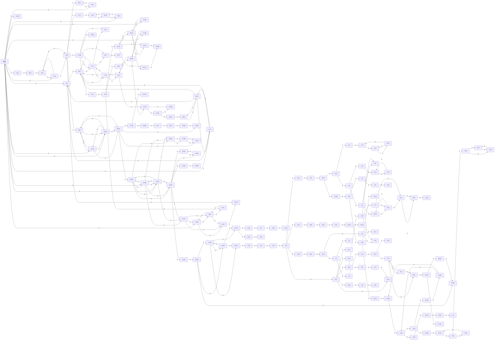

https://visualgo.net/zh

[https://mermaid.live/edit](https://mermaid.live/edit#pako:eNqFmM1u20YQgF_F4Nk0OMt_HQKIS1EimVOPhS5CJNsBbClQZKSt40vfqSj6RO1jVDI0P9sZpj5ZH2bnf2ZXeo0-Hba7aBbdPx2-fXrcHE83H39a72_Of__88effv_91E8cfvsP3m3kMNnY2Tm2c2Ti3cWHj0saVwu6C64lwkgk-ESdMRAQTIcFETDARFExEBdUEv8Z1_g9hg-k9V0U7eK4JCxbIMmaALGeWGqxEVlhGStUxggkPBcspkkQcdpo2WONLmXSqJW1iZ0GggMDp2l7iUN0XQtaa656RtLFEAwcKQSktUOoWlVSmoDSzVQm118Q0MagRbIIeAQvmCrL_DXfT3ILUTgFzinlDzlPkDfen58OCkYsixbViczaSqzUSnKXkFKrfG9nauWI0K-cK6RKG0Cno2XKtBqMJWpjCA5lY0NTL-ktamJTClO0uZOWmMGS9CCugFFgwMZWmPjYhNxdPjJcKRAmAkuNEx7vEpGBSp2lDafBykBwyGo8W-yxgWo76TDDqZS93coVMZ8kbfRvIkd3KsGFsiUAQs-7F-hUqGYqYJTQlS_M4n5cZN2hL4-TF-uaq-7ChQdNAQ6b3rzfb3Jtt7kWXtlKDpFQrqPSotVz9BSasjQu1EwIGGra4E1peRy1eX204Nkwrtn31Z8HHF6hywfuopdMTL8GJF5Wj29El-r0TUlvWOU15KEMqNIBpzVgMc3MFzM0VEFJhzZnWBHWpSTOT5iZlH-Tu5_Um85Bq6k1ZLwbo_2grFkNAeQRrbU1SqSGg1MM8rgueADnDFbYmTWWHLdxxCy9x2S15KXa0FVp5IbNp4TxFVON3Cc8LrGQ5uhrEmFGEKZ5d8JoUTMt1vN4FcxgxcCQFRlxwxDVGTHGs0IZgS9qCK3509SgYsGsKe2YDyg3MRpQbOdUjOjiyg0KuUPp6PjtgwAHL0K5jfYD6gFmKLFVyA7fMgIkWbKTEjOKKGjGtI6dwxFYYuRVG1Dhybw10XSyFxhVqXLHGHjUGDLd9z2YGTOwgE0tyIKNxJs0oRknJeZDe52gLRCUwS_-h1BjXSN27XioHyHpw4ahyH7lKgWhhUqoJiCwA9VfgmEGDgEVZgeoKIuM1uiBL4xQcRL34gbKKTVhguTODFerwgNVy0s2OW22Jp5dyI1TIKt4cNZ6V6zenHZijmZZiXMRi_ZKkEEyR0dLqY1BsQNbzvPY864JRxkTCAJMDHB4tt1T9DiRYh3JdLO6WQrEObSzk44qfa_KrhnOaevmlwum7uGPXhXlQbg5ynTnFBixBx-lZousBcwbLFFsZciu0sWLWGaynAe_kNUtGMuVML-Z44AtGwtKCtK5LtYQDVv9oMdd61a_Y7x4P98Ggw4--gNpP-8u7znzN5ebLT_4UVEW30cPx8zaanY4vu9voeXd83lw-Rq8X-XV0etw979bR7Pzvdne_eXk6raP1_u187Mtm__Ph8Iwnj4eXh8dodr95-nr-9PJluznt2s-bh-OGRXb77e7oDy_7UzSry_JdRzR7jX6JZs4Vd0UO4JIszasyh-I2-jWaxemdK9O0qPOqSBOos_ztNvrt3SzcnT8nSQ0FVHmSJXX29i-zgWgq)

https://www.mergepictures.net/zh-CN/grid

- 合并宽度1480
- 合并高度1450

**迷宫概况**

- 12层立体迷宫，每层分割为多块区域

- 最短通关路径含 **25个关键节点**

- 岔路与死胡同超过 **200条**

- ##### 单人无提示通关预估 **1～3小时**

三套降难方案，诚邀投票（每项至少5人参与）：

------

**方案一：渐进提示**
各自独立闯关，每人每通关1分钟，系统告知下一个关键点（共25个），逐步推进。

**方案二：合作锁点**
团队分工，快速排除错误岔路；任一队员抵达关键点(迷宫中设立标志物)，即时提示并 **暂停计时**，待全员会合后继续计时向下探索，避免重复回溯。

**方案三：上帝视角指挥**
内部自由分角色：指挥官获取12张二维地图+建造模式自由视图，自由穿梭推演最优路线，其余队员依令行动，实现策略与执行分离。

**更多降难方案**

缩放：

https://www.xiaohongshu.com/explore/6a4747150000000021018dba?xsec_token=ABnnIsfsYAt3OxtcpYN8gMBbbWHyKO4rKeS1_K9y_Kg88=&xsec_source=pc_search

https://www.xiaohongshu.com/explore/6a2e86e2000000000702caf9?xsec_token=ABIYV6-Jqv0S_ZsyYC6Tawv0VYfEtGMMWGVMpClz01amQ=&xsec_source=pc_search&source=web_explore_feed
