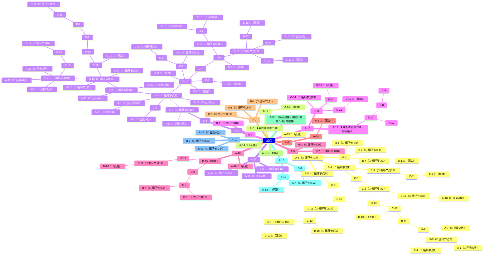

循环组数：25




------


```mermaid
mindmap
  起点  
    A-20
        A-17（🔥 解锁）
        A-21（🔄 回到A层）
        A-22（🔥 解锁）
        B-16
            C-18
                C-17（🔄 循环节点6）
        B-21（🔄 循环节点18）
    A-21
        A-17（🔥 解锁）
        A-20（🔄 回到A层）
        A-22（🔥 解锁）
        B-16
            C-18
                C-17（🔄 循环节点6）
        B-21（🔄 循环节点18）
    A-22（✨ 前置A20-A21）
        A-17
        A-23
        A-24
        A-25
        A-26
    A-23
        B-20 
            B-23（🔄 循环节点32）
            C-20（🔄 循环节点20）
            	C-19（🔄 循环节点19）
            	D-13（🔄 循环节点21）
            	D-19
            		C-9 🔴（死路）
            C-19（🔄 循环节点19）
            	C-20（🔄 循环节点20）
                D-13（🔄 循环节点21）
                    E-4
                        F-7
                            G-5
                                F-11 🔴（死路）
                    D-8
                        A-9（🔄 回到A层）
                D-19 
                    C-9（多层楼梯，从五层到三层）
                        C-7
                            C-6
                                C-3（多层楼梯，从三层到五层）进度表5
                                    E-1
                                        F-6
                                        	G-9
                                        		H-3 进度表9
                                        			I-3
                                        				J-3（🔄 循环节点23）
                                        					K-5（🔄 循环节点22）
                                        						K-6
                                        							K-5（🔄 循环节点22）
                                        							J-3（🔄 循环节点23）
                                        			I-5
                                        				J-2
                                        					K-1
                                        						K-3（🔄 循环节点24）
                                        					K-3（🔄 循环节点24）
                                        						K-1（🔄 循环节点25）
                                        				J-4 进度表11
                                        					J-8
                                        					K-10
                                        						K-9
                                        							K-7
                                        								K-8
                                        									J-12(错误答案，很深，表10)
                                        				
                                            G-10
                                                H-9
                                                	I-7
                                                		J-6
                                                			K-4 🔴（死路）
                                                	I-14 进度表11
                                                		K-12 🔴（死路）
                                                		K-14
                                                			K-18（🔄 循环节点31）
                                                				J-15（🔄 循环节点30）
                                                					J-10(多层楼梯)
                                                						K-13
                                                							K-11
                                                								L-1(出口)
                                                					J-13
                                                						K-16
                                                							K-15
                                                								J-15（🔄 循环节点30）
                                                								K-18（🔄 循环节点31）
                                                						K-19
                                                							K-17
                                                								J-9（🔄 循环节点28）
                                                									I-12
                                                										H-4（🔄 循环节点27）
                                                											H-6（🔄 循环节点26）
                                                										H-6（🔄 循环节点26）
                                                											H-4（🔄 循环节点27）
                                                									J-14(多层楼梯)
                                                										K-17
                                                											J-9（🔄 循环节点28）
                                                				K-15(（🔄 循环节点29）
                                                					K-16
                                                						K-15(（🔄 循环节点29）
                                        F-8
                                            G-6
                                            	G-8
                                            		F-9
                                            			D-15（多层楼梯）
                                            				D-12 🔴（死路）
                                    E-3 进度表5
                                        D-5（多层楼梯）
                                            D-3（多层楼梯）
                                                I-1
                                                    I-2
                                                    	H-1 表9
                                                    		G-3
                                                    			A-8
                                                    			F-3
                                                    				E-6
                                                    					D-17
                                                    						B-22
                                                    							B-23(（🔄 循环节点32）
                                                    						C-21
                                                    				F-1
                                                    					E-6
                                                    					F-3
                                                    	I-4
                                                J-1
                                                    K-2🔴
                                                    J-5
                                        F-2
                                            G-1
                                            G-2
                                            G-4
                                            H-2
                                                F-5
                                                    F-4
                                                        G-2
                                                I-13
                                                    J-5
                                                    J-7
                                                        K-7
                                                            K-8
                                                        K-9
                                                            K-10
                                                    J-8
                                            H-5
                                                I-9
                                                    I-11
    A-24
        A-25
    A-25
        A-24
    A-26
        B-18 🔴（死路）
```


###### 


- ##### 深度超过3的分支，需要用不同颜色区分
- 重复出现的数字，代表两两之间相同，需要两两特别标注，或者线条链接
