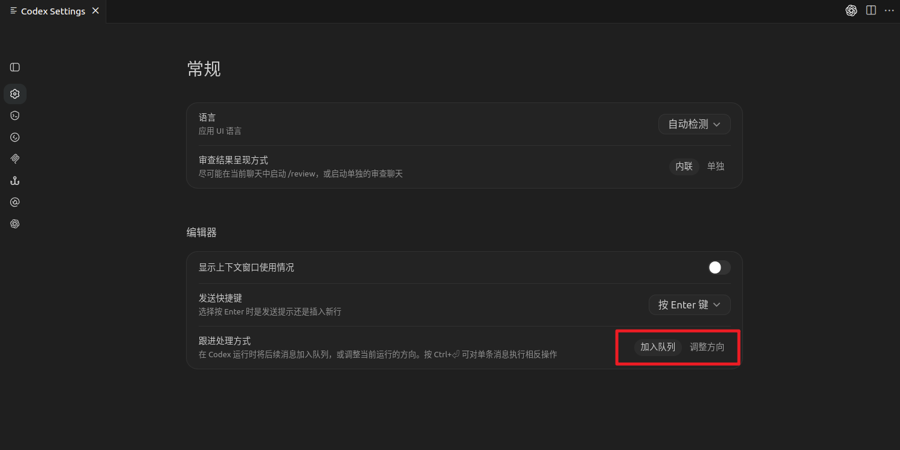
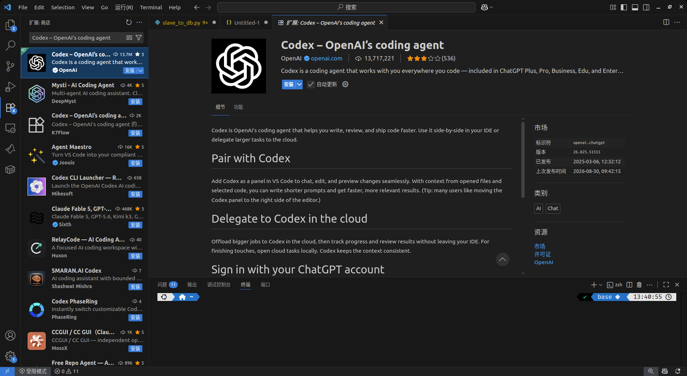
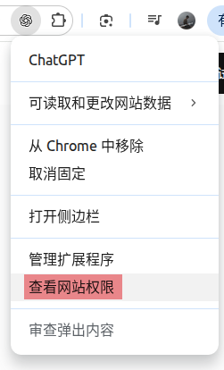
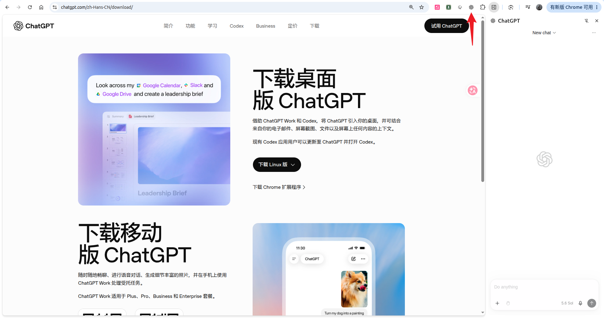

# 1 Codex Desktop

## 1.1 提示词概述

简短的提示词通常就足够了。对于规模更大或更重要的任务，请包含 真正重要的部分：

- **目标：** ChatGPT 应该做什么？
- **上下文：** 哪些信息或资料来源会有所帮助？
- **输出：** 您需要什么格式、篇幅或详细程度？
- **边界：** 哪些内容必须保持不变？ChatGPT 应避免什么，或在采取行动前就哪些事项 向您确认？

只需包含有帮助的部分。您不必填写每一项，也不必遵循 规定格式。

## 1.2 描述您需要的结果

> 请把会议纪要整理成一份简短的项目团队进度通报
>
> 把已定事项和后续安排放在最前面

先说明预期结果，而不是详细列出步骤。只有当流程本身很重要时，才需要描述具体流程。

## 1.3 添加有用的上下文

- 文档：文档、电子表格、演示文稿或 PDF 文件
- 图像：添加屏幕截图、图表
- 网页：链接
- 项目：本地文件夹

## 1.4 个性化 ChatGPT

在 **设置 > 个性化**中，将适用于所有聊天的偏好设置为自定义指令。仅与当前聊天相关的细节应保留在提示词中。

## 1.5 引导和排队

当 Codex 正在工作时，您无需等待当前运行结束， 就可以发送另一条消息：

- **引导/调整方向**：会将消息添加到当前运行中，可用于调整方向、补充 遗漏的细节，或分享新信息。
- **排队/加入队列**：会将消息留待下一次运行处理，适用于需要等到当前工作完成后再处理的后续消息。

在 ChatGPT 桌面应用中，可以在 [**设置 > 常规 > 后续消息行为**](https://learn.chatgpt.com/docs/reference/settings#general)中选择默认行为。 排队的消息会显示在消息输入框上方，您可以编辑、重新排序、发送或 删除这些消息。该设置还会显示相应快捷键，让您无需更改默认行为， 即可为单条消息采用另一种处理方式。

## 1.6 快捷指令

| 快捷指令                  | 功能描述                                                 |
| :-------------------- | :--------------------------------------------------- |
| **IDE 上下文**           | 切换是否将当前 IDE 打开的文件、光标位置和编辑历史作为上下文传给模型                 |
| **MCP** (`/mcp`)      | 查看 MCP（模型上下文协议）服务器连接状态，确认外部工具/数据源是否就绪                |
| **创建聊天分支** (`/fork`)  | 复制当前对话到新分支，便于在不影响原会话的前提下尝试不同思路                       |
| **初始化** (`/init`)     | 在项目根目录生成 Codex 使用说明和配置指引文件（如 `AGENTS.md` 或 `.codex`） |
| **压缩** (`/compact`)   | 对对话历史进行智能总结压缩，释放上下文令牌占用，防止超出窗口限制                     |
| **反馈** (`/feedback`)  | 向开发团队提交当前聊天质量或功能体验的反馈                                |
| **推理** (`/reasoning`) | 调整模型内部推理强度（轻度/深度），深度模式可提升复杂问题处理能力                    |
| **模型** (`/model`)     | 切换当前对话使用的底层大语言模型                                     |
| **状态** (`/status`)    | 显示会话详细信息，包括聊天 ID、已用上下文令牌数、响应速度等                      |
| **目标** (`/goal`)      | 设定长期固定的会话目标（如“始终使用 Python 3.11+ 语法”），模型将围绕该目标生成回答    |
| **计划模式** (`/plan`)    | 开启后模型先输出执行步骤或大纲，确认后再展开完整回答，适合复杂项目                    |

# 2 VSCode

## 在IDE能做什么？

无需离开代码，即可让 Codex 进行解释、编辑、审查和任务委派。

- 利用当前已打开的上下文
- 对照代码审查更改
- 任务规模扩大时委派处理

# 3 Chrome extension

> 注意事项：需要先安装Codex 桌面端

## 它适合做什么？

Chrome 浏览器控制插件不是单纯帮你搜索答案，而是让 Codex 进入网页里完成连续动作。

常见任务包括：

1. 打开指定网站；
2. 按关键词搜索内容；
3. 翻页浏览结果；
4. 读取页面文字或图片信息；
5. 点击按钮、填写输入框；
6. 截图并整理结果；
7. 按要求分类归档。

所以它**更适合网页事务型任务**，比如**资料搜集、竞品分析、素材筛选、网页信息整理**。

但这类插件会接触本地 Chrome 的页面状态和已登录站点内容。**涉及账号、付款、隐私信息、后台管理系统时**，**不建议完全自动操作**，关键步骤最好人工确认。

- 后台同步【允许 -> 屏蔽】
- 付款处理程序【允许 -> 屏蔽】
- 第三方登录【允许 -> 屏蔽】

## 实操实例

### 3.1 查找并整理网页素材

> 帮我去 Pinterest 搜一下“个人简历网站”，找 20 张高质量的参考，按浅色调、深色调、极简风格三个方向分好类，统统下载到我电脑的桌面。

这个任务拆开看，Codex 需要完成：

1. 打开 Chrome；
2. 进入 Pinterest；
3. 搜索“个人简历网站”；
4. 浏览搜索结果；
5. 根据视觉风格筛选图片；
6. 按浅色调、深色调、极简风格分类；
7. 下载或整理到电脑桌面；
8. 生成记录图片来源的 CSV 文件。

这个案例的重点不是 Pinterest，而是“网页搜索 + 筛选 + 分类 + 文件整理”这一整套流程。

同样的思路也可以用在：

1. 整理竞品官网信息；
2. 收集公开资料并生成表格；
3. 检查网页里的价格、功能、更新说明；
4. 对比不同工具页面介绍；
5. 截取页面证据并整理成文档。

### 3.2 分析网页

> 请你查看url链接，帮我总结内容，并给出你的思考

### 3.3 处理重复性网页操作

> 搜索、筛选、复制页面信息、整理表格内容。

# 4 Mobile

- **不支持**使用 OpenAI API 密钥登录
- 需要VPN