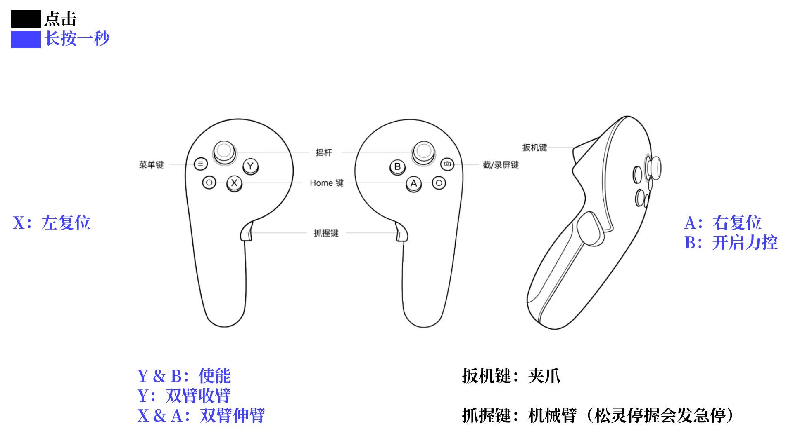
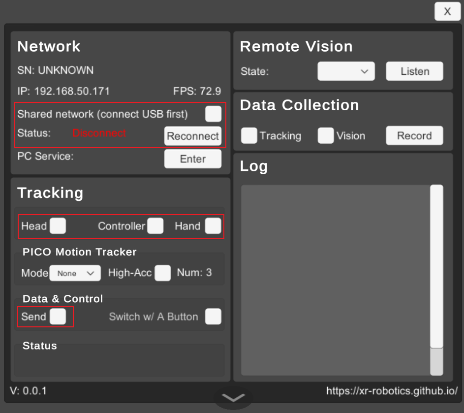

# 1 松灵双臂

## 1.1 启动
```shell
# 通过terminator执行
# 会启动四个窗口，并启动四个程序，第2个窗口需要密码
bash /home/zme/pico_tele_agx/start_xr.sh
```
若服务需要重启，在窗口中执行以下指令：
```shell
# 左上第1个窗口执行
bash 1start_xr.sh

# 左下第2个窗口执行
bash 2start_can_agx.sh

# 右上第3个窗口执行
bash 3start_agx.sh

# 右下第4个窗口执行
bash 4start_tele.sh
```

## 1.2 失能

```shell
ros2 service call /left/enable_agx_arm std_srvs/srv/SetBool "{data: false}"
ros2 service call /right/enable_agx_arm std_srvs/srv/SetBool "{data: false}"
```

# 2 Lite机械臂
```shell
# 通过terminator起两个窗口

# 第一个窗口，执行
bash /home/zme/pico_tele_zme/docker.sh
bash 1start_xr.sh


# 第二个窗口，执行
bash /home/zme/pico_tele_zme/docker.sh
bash 2start_tele.sh
```

# 3 XR 连接配置指南

请按以下顺序操作：

| 步骤  | 操作项     | 详细说明                                                    |
| :---- | :--------- | :---------------------------------------------------------- |
| **1** | **机器端** | 启动 `start_xr` 服务                                        |
| **2** | **VR 端**  | 打开 **XRoboToolkit**                                       |
| **3** | **连接**   | 勾选 **Shared network**（有线通信），等待片刻后选择目标 IP  |
| **4** | **配置**   | 勾选 `Tracking` 下的 `Head`、`Controller`、`Hand` 及 `Send` |



| Item                                           | Description                    |
| ---------------------------------------------- | ------------------------------ |
| Network - SN                                   | 显示XR设备的序列号，仅适用于Pico 4 Ultra企业版 |
| Network - IP                                   | XR设备的IP地址                      |
| Network - FPS                                  | 数据同步帧率                         |
| Network - Status                               | 机器人与XR设备之间的连接状态                |
| Network - PC Service                           | 运行PC服务的计算机IP地址                 |
| Network - Enter                                | 手动输入PC服务的IP地址                  |
| Tracking - Head                                | 开启/关闭发送头部6自由度姿态数据              |
| Tracking - Controller                          | 开启/关闭解析VR控制器的6自由度姿态和按钮状态数据流    |
| Tracking - Hand                                | 开启/关闭解析手部追踪数据流                 |
| Tracking - PICO Motion Tracker - Mode          | 下拉菜单选择无、全身追踪（需要Pico追踪器）以解析数据流  |
| Tracking - PICO Motion Tracker - TrackerNum    | 追踪器数量                          |
| Tracking - Data & Control - Send               | 开启/关闭在XR设备和机器人PC之间同步上述选定的姿态数据  |
| Tracking - Data & Control - Switch w/ A Button | 开启/关闭通过右手控制器A键快速暂停或恢复同步        |
| Tracking - Status                              | 显示追踪相关信息的面板                    |
| Remote Vision - State                          | 显示摄像头状态                        |
| Remote Vision - Dropdown (Video Source)        | 选择支持的视频源                       |
| Remote Vision - Listen                         | 打开连接以接收所选视频源的视频流               |
| Data Collection - Tracking                     | 是否记录姿态追踪数据                     |
| Data Collection - Vision                       | 是否记录视觉数据                       |
| Data Collection - Record                       | 开始/停止录制                        |
| Log                                            | 显示日志                           |
